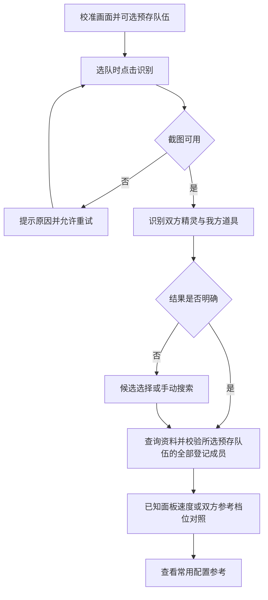
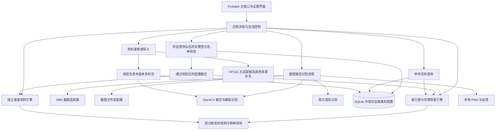
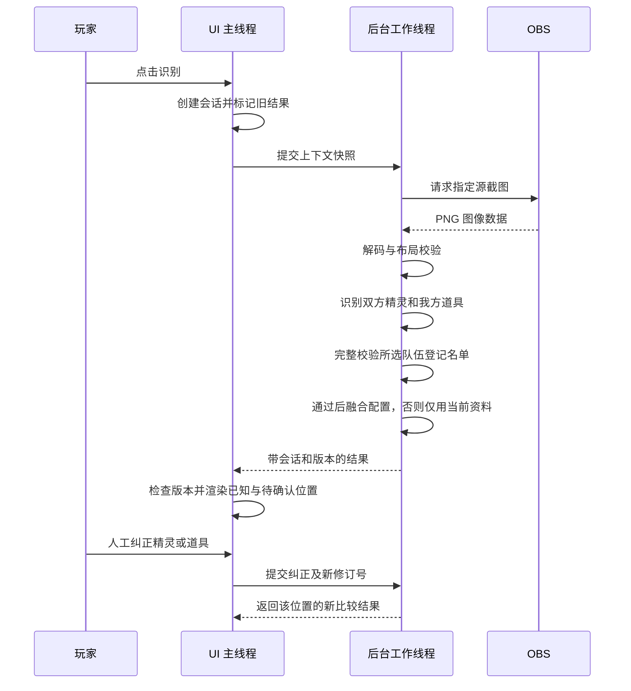
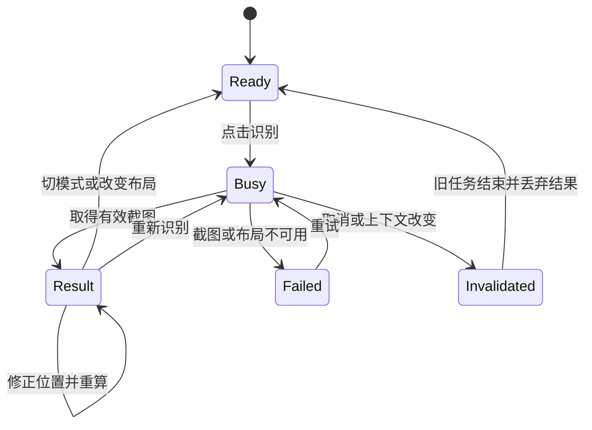
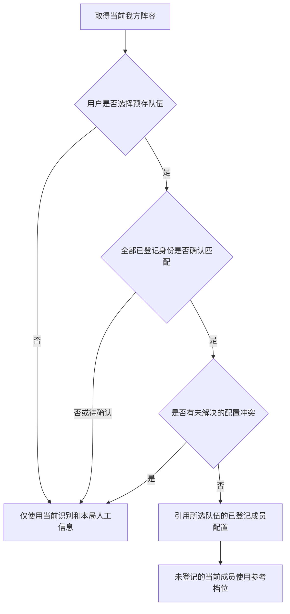
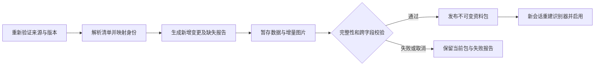
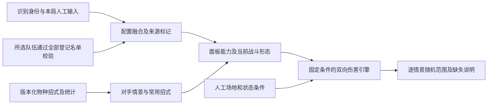

# Pokemon Champion Assistant v0.2 - Data and Damage Plan

## Goal Capsule

- **目标：** 识别队伍后提供属性、通常／超级形态种族值、速度及双向招式伤害情景，帮助玩家判断出手权和攻防选择。
- **设计依据：** 双方均从当前画面识别，并识别我方可见道具；我方配置按队伍预存，必须完整匹配该预存队伍已声明的成员范围，才允许引用其配置。
- **版本边界：** 已实现右侧对手名称识别、静态资料与图标自动更新、桌面属性／Mega／招式展示、M-6 双打招式采用率、50 级参考速度线，以及按队伍保存培养配置和手动我方阵容的整队匹配。真实 OBS 连接和截图已验证，正确选队画面的设备端到端识别仍待补充。我方自动识别、实际能力计算、其他统计字段与双向伤害尚未实现；具体进展见 Revision Summary。
- **执行依据：** Product Contract 定义产品行为，Planning Contract 定义技术边界，Implementation Units 定义开发顺序，Verification Contract 与 Definition of Done 定义交付标准。
- **验证门槛：** 无阻止开始开发准备工作的架构问题；真实画面、游戏计算规则和资料获取的验证结果决定相应功能何时可以启用，不能以猜测补齐。
- **交付范围：** Windows 本地可运行程序和使用文档；此计划不包含发布到互联网、推送远端或创建 PR。

---

## 2026-09-09 阶段进展：对手图标识别原型

- 输入项目根目录 `例子.png`，输出右侧从上到下六只宝可梦的简体名称；使用全量本地图标进行多尺度模板匹配。
- 原图六个位置均识别成功：苍炎刃鬼、风妖精、巨金怪、来悲粗茶、烈咬陆鲨、姆克鹰。根据用户后续确认，来悲粗茶和彩粉蝶的外观形态统一按种名输出，不提示外观歧义；合并规则由独立配置表登记，会影响对战数据的形态仍独立识别。
- 命令行入口 `recognize_opponent.py`，批处理入口 `run_recognition.bat`；可调整裁剪配置，输出 JSON、名称文本和 HTML 核对页面。
- 13 项验证通过，涵盖原图、缩小压缩、换序、空白/噪声拒识、布局比例、额外合成图标和外观形态候选合并。真实游戏样本目前只有一张，这不是总体准确率评估。
- 本阶段环境为当前可用的 Python 3.13.5，识别依赖锁定在 `requirements.txt`；完整桌面应用的环境和界面选型仍以后续实施为准。

---

## Revision Summary

### 2026-09-11：队伍详情截图导入

- U12 增加录入通道：本地 RapidOCR 读取能力／状态两页，卡片定位、数字分区、性别及性格颜色标记结合字典验证。两页队伍码与逐槽身份一致才能合并，新队伍草稿经过人工核对再保存，继续遵守 U2 整队引用规则。
- 原图样例六只成员、36 项培养点、6 个性格、6 个特性、6 件道具、24 个招式全部核对通过；36 项面板值仅保存来源证据。队伍码存在 0/O OCR 混淆，必须人工核对，未线上验证。
- 未确认官方公开查询 API。发现第三方队伍查看器，但实际查询返回服务器维护的应用级 503，未接入在线队伍码导入。
- 未覆盖其他页面布局、视频自动翻页或战斗选队我方实时识别。操作见 [截图导入指南](../../截图导入队伍指南.md)，验证见 [截图导入验证](../validation/team-import.md)。

### 2026-09-11：队伍培养配置与整队匹配

- U2：本地 SQLite 保存命名队伍、显式完整／部分登记、成员配置和修订号；整队匹配通过后才返回该队伍的成员配置，4/6 不引用，显式部分 4/4 只引用四只。加入道具冲突、形态歧义、重复身份拒绝。
- U4／U12：主窗口新增队伍管理入口，支持培养点、性格、特性、道具及四招编辑，另存副本、删除与重载。当前我方阵容独立手动确认，不以预存名单代替当前识别事实。新截图撤销确认，编辑或换队重新校验。
- 录入规则使用 OP.GG 计算器单项 32、总计 66 的来源证据，保留未知值。性格／道具／特性名称目前为随程序提供的来源快照，尚未自动更新。未实现 U6 我方图像识别、U12 实际能力计算、U13 伤害引擎。
- 验证与边界见 [队伍配置验证](../validation/team-builds.md)，操作见根目录 [队伍配置使用指南](../../队伍配置使用指南.md)。

**2026-09-11 更新触发方式修正：** 按用户澄清关闭 Codex 自动化，保留独立 `scripts/update_usage_data.py`。软件启动后调用 `--if-due --json`，持续运行每小时检查，完整成功同步未满 24 小时不联网。独立进程与 OBS／识别工作线程隔离；成功自动刷新招式列表，失败继续用缓存，下次检查重试，退出软件终止未完成更新并保留已发布快照。当前无账号登录，启动软件即为触发点；不是常驻服务，也不承诺来源数据实时同步。

**2026-09-11 后续修正（OBS／采用率／速度线）：** 确认本机连接问题来自 OBS WebSocket 未启用；用户开启后真实连接 OBS 32.2.2 并取得 3840×2160 画面。新增本机 OBS 设置读取按钮、分原因错误提示、纯音频源过滤及根目录 `OBS使用指南.md`。新增 `data/usage.py`、`scripts/update_usage_data.py`，动态发现 OP.GG 公开只读统计入口，显式按当前赛季／双打读取招式采用率，已同步 M-6 的 245 个统计身份。采用率独立快照原子发布；按采用率降序，缺率按固定威力降序，不混用单打／上赛季／未声明的其他形态。最初误建的 Codex 定时任务已关闭；改由软件启动与运行期间调用共享脚本，满 24 小时后台更新，协作者也可单独使用批处理。新增 `speed.py` 与速度线表，六档参考计算及并排比较与用户截图一致。69 项测试通过，证据见 `docs/validation/usage-speed-obs.md`。下一阶段继续按命名整队保存培养点、性格、特性、道具及四招，完整 6 人队仅匹配 4 只时零引用；主动仅登记 4 只且全部匹配才可引用登记成员，本轮不改变这条规则。

**2026-09-11 实施进展（桌面资料展示）：** 按用户授权提前实现 U4/U14 的只读切片：PySide6 主窗口、后台图片识别、拖入图片、OBS WebSocket v5 只读源截图接口、槽位纠错、属性及普通／Mega 并排种族值、伤害／变化分组、招式属性／威力／命中、悬浮与点击详情。实现位置为 `ui/main_window.py`、`ui/worker.py`、`ui/obs_dialog.py`、`ui/widgets.py`、`capture/obs.py`、`data/references.py`、`data/moves.py`，以此替代本切片原先预计的细分 UI 文件。资料更新增加版本化 `moves.json`，真实同步发布 920 条招式定义；界面只展示来源标为可用的招式池，不冒充双打使用率排名。采用独立官方 CPython 3.13.7 的 `.venv-ui`，避免现有 Anaconda 继承环境的 Qt DLL 冲突。55 项自动测试通过，示例六只仍全部正确；使用与验证见 `docs/desktop-ui.md`、`docs/validation/desktop-ui.md`。已打开本机界面，真实 OBS 采集需用户启用 WebSocket 并输入连接设置后继续联调。双方识别、预存队伍、能力／伤害引擎、持续采集、安装包和总体识别指标未因此完成。

**2026-09-10 实施进展（自动更新阶段）：** 已实现 `scripts/update_pokemon_data.py` 的 check/sync/validate/rollback，OP.GG 静态资料适配、跨站别名、百科图标／文件库补查、增量下载、不可变资料包与识别器固定版本读取。本次实际同步到 231 种／398 形态／782 张图标，391 形态图标就绪、7 形态待补；用户操作与证据见 `docs/data-updates.md`、`docs/validation/data-updates.md`。这是 U10/U11 的静态目录交付切片，尚未完成双打统计适配、UI 后台更新、数据库整合或 U12–U15；不把本阶段完成等同整个 v0.2 已交付。以下调研数字保留为版本更新前的基线。

2026-09-10：保留 R1–R19、F1–F4、AE1–AE18、U1–U9 的标识和整队预存规则；扩展 R2 的配置内容，新增 R20–R31、F5–F7、AE19–AE30、U10–U15。伤害计算从暂缓项移入本版分阶段交付，双打为默认模式。原文件继续作为唯一主计划。

本次调研直接取得 OP.GG 图鉴内嵌的 352 个资料条目，其中 35 个带 `isNew` 标记；与本地目录初步比较发现 22 个未覆盖的基础物种候选，例如暴飞龙、具甲武者、轰擂金刚猩、闪焰王牌、戟脊龙。该比较还不含所有地区／超级形态差异，不能把 35 个“新”标记理解为 35 种全新物种。百科本次响应仍为旧主列表 361 条／209 种，说明单靠重跑原百科脚本不足以发现版本变化。证据保存在 `docs/research/2026-09-10-opgg/roster-comparison.json`，未修改运行中的 `pokemon/index.json`。

优先顺序：**先同步名单与基础资料 → 展示属性、Mega 和招式 → 完善队伍配置 → 启用经过核验的双向伤害 → 后续完善单打建议与更复杂机制**。

---

## Product Contract

### Summary

制作一个中文、面向个人使用的本地对战参考工具。
玩家在选队界面按下识别按钮，工具识别双方阵容与我方可见道具，并提供双方的条件速度比较和常用配置参考。
新版同时展示属性与可用超级形态，支持登记我方培养点、性格和四个招式；选中双方成员后比较“我打对面”和“对面打我”的条件伤害区间。统计资料和未知对手配置始终以参考或假设呈现。
我方配置按命名队伍保存；只有选定预存队伍的全部已登记成员都匹配当前阵容，才允许引用该队伍的配置，否则整支当前阵容不引用预存数据。
用户可明确只预存一支队伍中的部分成员；例如仅登记四只时，这四只全部匹配便可引用它们的配置，其余两只使用识别后的参考档位。

### Problem Frame

玩家在对战中不熟悉双方宝可梦的速度线，经常误判谁先行动。
选队时间内逐个查询资料会打断判断，而只查看速度种族值又无法表达配置差异。
项目的价值是缩短本局资料查询和比较的时间；识别准确率本身不是最终目标。

### Key Decisions

- **手动触发一次识别。** 以选队界面为固定场景，避免第一版依赖持续识别和自动场景切换。
- **双方始终识别，预存配置按队伍校验。** 我方和对方共用物种识别流程；只有选定预存队伍的全部已登记成员完成匹配后，才引用其成员配置，部分重合不能触发部分引用。
- **区分“仅预存四只”与“六只仅匹配四只”。** 前者允许在四只全部匹配后引用；后者整队禁用预存引用。预存条目属于特定队伍，不是按物种共享的配置库。
- **我方可见道具独立识别。** 道具与对应精灵槽位绑定，识别不清时允许纠正；可见道具能补充速度修正条件，不能证明该精灵的培养配置或实际速度。
- **输出速度关系及其条件。** 使用“在该假设下速度更高／相同／更低”，不把参考值表达为本回合必定先手。
- **先验证简单识别路线。** 先用真实游戏图标评估模板匹配或图像相似度；训练分类模型作为证据支持后的备选，不作为第一版的前置条件。
- **保留人工纠错。** 低置信度和相近形态需要可见的候选选择；纠正结果可积累为本地标注样本。
- **先服务一种已验证的画面配置。** 第一版以用户实际设备和选队布局验收，支持裁剪区域校准；不承诺任意 OBS 布局开箱即用。

### Key Flows

- F1. **准备。** 玩家选择对战模式、数据赛季及可选的命名预存队伍；保存队伍时明确完整六人名单或主动只登记部分成员。无需预存也可以直接识别。对应 R1–R4。
- F2. **识别。** 工具识别双方精灵及我方可见道具，创建本局阵容；先完整校验所选预存队伍的已登记名单，通过后才关联配置，未通过则不引用该队伍任何成员的数据。对应 R5–R8、R17–R19。
- F3. **比较。** 我方有可用面板速度时与对手档位比较；没有时展示双方档位组合，并应用已知或明确假设的道具条件。对应 R9–R13、R17–R19。
- F4. **纠错与重试。** 玩家可修改种类、形态、道具及配置关联，相关资料立即重算；本局纠正不自动改写预存队伍。截图失败时允许重试并标记旧结果。对应 R6–R8、R14、R17–R19。



- F5. **版本同步。** 查看新版本差异，执行同步，检验通过后发布资料包；新增但图标或规则未就绪的条目单独列出，当前对局继续使用固定快照。对应 R27–R29。
- F6. **配置与攻防比较。** 在命名队伍下录入培养点、性格、招式等，完整校验预存名单；选中双方成员，指定对手配置情景及通常／Mega 形态，查看两个攻击方向的招式伤害。对应 R20–R26、R31。
- F7. **招式浏览。** 伤害招式、变化招式分组；悬浮展示摘要，点击或键盘打开详情，查看当前模式的使用参考，切换模式不混用统计。对应 R22、R23、R30。

### Requirements

**输入与我方队伍**

- R1. 我方配置按具有独立名称和 ID 的队伍保存，每队最多六个成员，并明确标记完整名单或主动登记的部分名单；未选择队伍也能识别和比较。
- R2. 成员配置属于其队伍，包含种类、形态、游戏面板实际速度、道具和特性，并按 R21 扩展培养点、性格和招式；同种同形态在不同队伍中的配置相互独立，缺失字段显示未知。
- R3. 用户可以预览来自 OBS 的游戏画面并校准精灵裁剪区域，裁剪位置以游戏图像为参照。
- R4. 用户可以指定单打或双打及数据赛季，所有使用率资料必须属于当前选择的模式与赛季。

**阵容识别**

- R5. 一次按钮操作识别当前选队画面中双方可见的精灵位置，并保留位置与识别结果的对应关系。
- R6. 无法识别的种类或形态显示未知或待确认，不能强制归入最相近的已知类别。
- R7. 每个位置均可查看裁剪图并手动修改识别结果，修改后立即更新相关比较和资料。
- R8. 我方始终识别当前阵容；所选预存队伍全部已登记成员均一对一匹配后才引用配置，任一登记成员不匹配或尚未确认时，不引用该队伍任何成员的数据。

**速度与对手参考信息**

- R9. 我方有可用面板速度时展示已知值对参考档位的比较，否则展示双方参考档位的组合，明确我方实际速度仍未知。
- R10. 对手参考档位至少包含中性修正且无速度投入、中性修正且最大速度投入、加速修正且最大速度投入，并明确档位所用条件。
- R11. 用户可查看讲究围巾假设下的速度比较；我方已知且受支持的速度修正必须列明，未支持的修正不得被静默忽略。
- R12. 每只对手提供常用招式、可能特性和常用道具参考，带上可用的使用率、数据来源、模式、赛季及更新时间。
- R13. 每个参与比较的字段必须区分画面识别、本局人工输入、预存引用和情景假设，统计使用率不得显示为本局携带概率或已确认配置。

**错误恢复与数据可用性**

- R14. 截图失败、区域为空或结果待确认时显示对应状态，重新识别期间旧结果必须标记为上次结果。
- R15. 已取得的参考数据可在本地重复使用；更新失败时允许使用带更新时间的旧数据，没有数据时显示缺失，不填造使用率。
- R16. 识别裁剪图与人工纠正标签可保存为本地样本，并允许关闭样本保存。

**我方道具与配置融合**

- R17. 按我方槽位识别可见的具体道具并支持人工纠正，区分已识别、明确无道具、仅知携带和不可读；不能从泛用携带标记推断具体道具。
- R18. 我方道具依次采用本局人工纠正、可信画面识别、通过队伍校验且无冲突的预存引用，始终保留来源；冲突按队伍级融合规则处理。
- R19. 当前阵容和各预存队伍独立保存，仅用户主动保存才更新指定队伍；队伍校验不通过时仍可使用识别和本局人工输入，不跨队伍拼接配置。

**新增资料与攻防比较**

- R20. 双方宝可梦显示当前形态的一到两个属性及六项种族值；可超级进化者在旁边显示已核验可用的各 Mega 形态、属性、六项值和差值，多个分支分别列出。
- R21. 我方成员可按队伍登记六维培养点（努力值）、性格、四个招式、特性、道具及可选配置页面板能力；按 Champions 规则验证，空字段保留未知，当前 HP 属于本局状态。
- R22. 对手显示所选模式／赛季的常用招式、性格和加点分布；网站的联合样本配置与各项独立使用率分开，均不当成本局真实配置。
- R23. 招式默认显示属性、物理／特殊／变化分类、威力和命中率；伤害招式与变化招式分组，悬浮提供效果摘要，点击或键盘操作打开完整详情。
- R24. 选定一对双方成员后，按我方已填招式计算我打对面，按对手常用或手选招式计算对面打我；每条显示固定配置下的随机伤害范围、HP 数值及目标最大 HP 百分比。
- R25. 对手培养点、性格等未知时，提供明确命名且可修改的情景对比；随机波动与配置不确定性分别呈现，不给无统计依据的组合概率或综合击杀概率。
- R26. 伤害结果携带所选形态、配置、场地、规则版本及支持范围；变化招式显示无直接伤害，未支持或资料缺失的机制不产生伪精确伤害数值。
- R27. 资料区分游戏版本、规则集、统计赛季、对战模式和来源快照；中文名只用于显示和别名检索，不作为跨站关联、队伍配置或缓存的唯一键。
- R28. 更新工具提供检查差异、增量同步、校验与回滚；刷新网页而复用未改变的图片，输出新增、变更、缺失、移出与待映射清单，失败保留已发布资料。
- R29. 新宝可梦分别标记资料、图标、识别和规则是否就绪；资料更新后重建相关缓存，当前会话固定旧快照，新会话启用完整新快照。
- R30. 全部合法招式池按游戏规则版本维护；常用配招、使用率及战术建议按单／双打分别展示。本版优先双打，单打专门建议和丰富描述留后续。
- R31. 原有整队预存校验和字段来源规则覆盖所有新配置及派生伤害；外观合并沿用显式允许名单，只有对战等价已确认的外观可统一名称，不能由相同种族值推断等价。

### Speed Comparison Contract

**三个概念分开显示。** 速度种族值是物种资料；面板实际速度是某只宝可梦的配置结果；有效速度是指定道具、特性等条件后的比较值。
任何一方都不能仅从精灵或道具图标读取实际培养配置；我方缺少可用预存值或本局手动输入时，同样从种类和形态推导假设档位。

沿用基础速度比较的默认场景：指定形态、能力变化等级为零、无天气或场地等外部速度修正。伤害情景的天气、场地等输入不自动扩展速度引擎的支持范围；两处分别显示实际采用的条件。
招式优先度、同优先度内的特殊行动规则及戏法空间均不由速度大小直接判定。
上述范围必须在比较区域可见，不能只写在帮助文档中。

我方有可用面板速度时使用该值并标明来源；没有时使用与对方相同定义的三个基础档位，明确标记为参考而非已知值。
预存速度是保存时的配置值，并未被本次图标识别验证；用户可在本局补录或纠正。
已识别或人工确认的我方围巾等受支持道具修正，对已知面板值或每个参考档位各应用一次；仅因缺少面板速度不得阻止参考比较。
涉及天气触发特性、能力变化或形态变化而当前版本无法处理时，显示“此条件未纳入”，保留基础速度参考并撤下确定性的关系判断。
第一版不自动追踪这些状态。

双方的三个基础档位都是情景参考，不是完整的最小值到最大值区间。
减速配置和各种中间投入仍然可能存在，不把所列档位描述为全部可能性。
围巾档位表示“假设携带且生效”的结果，不因使用率较高就默认对手携带。

比较结果统一为：

- 我方速度更高：只对当前列出的条件成立。
- 速度相同：提示存在同速情形，不能保证行动顺序。
- 我方速度更低：只对当前列出的条件成立。
- 无法比较：种类、形态或必要规则缺失；仅缺少我方面板速度时切换为参考档位比较。

常用招式、性格、道具和能力点分布可能分别统计。
未经联合数据验证，不把各字段最高使用率拼成“最常见完整配置”，也不计算无依据的先手概率。

### Information Presentation

主视图按阅读顺序包含：当前队伍及模式、截图识别操作与状态、双方阵容及属性、选中成员的速度与双向伤害对照；详情区提供通常／Mega 种族值、招式分组和配置情景。
预存队伍选择提供“不使用预存队伍”入口；先显示队伍级状态，例如“完整队伍 4/6 匹配，未引用”或“部分登记队伍 4/4 匹配，已引用”。
每只我方成员再标注“引用队伍 X”“未登记，使用参考档位”“仅识别”等状态，单独显示道具来源，不能把 4/6 匹配显示成已有四只成功引用。
选中一对双方成员时，我方有可用面板速度显示一个值对对手三档；没有时展示三乘三档位表，行列分别标明双方假设，不默认某一档是真实配置。
速度对照是首要信息，常用招式、特性和道具在选中对手后展开。
识别待确认、资料缺失、过期数据和未支持条件需要文字标识，不能只依赖颜色。
具体窗口尺寸、左右布局、配色和快捷键留给界面设计与开发计划。

### Acceptance Examples

- AE1. **覆盖 R1、R2、R8、R9、R19。** 完整预存六只中只有四只与当前阵容匹配时，六只当前成员均不引用该队伍配置；已确认种类的成员照常提供参考档位和画面道具条件。
- AE2. **覆盖 R5–R7、R9。** 一个对手图标不清楚时，其他已确认成员正常显示资料，该位置保持待确认；人工选择后补齐该位置的比较。
- AE3. **覆盖 R9–R11、R13。** 某条件下我方速度较高，而加入对手围巾假设后关系反转时，两组条件均能查看，不能把任一结果写成无条件先手。
- AE4. **覆盖 R9–R11。** 在人工构造的比较输入中，双方有效速度都为 150 时显示同速；该示例不对应具体宝可梦或游戏计算公式。
- AE5. **覆盖 R2、R6、R9。** 我方面板速度缺失但双方种类、形态已确认时显示参考档位组合；任一方形态未确认时该比较不可用，不影响其他已确认成员。
- AE6. **覆盖 R4、R12、R13、R15。** 当前选择双打但只有单打统计时显示双打数据缺失，不静默用单打数据替代；更新失败且有匹配缓存时显示缓存时间。
- AE7. **覆盖 R3、R5、R14。** 采集源断开、截到非选队画面或区域异常时给出错误或待确认状态；之前的阵容不能显示为刚识别出的结果。
- AE8. **覆盖 R11、R13。** 我方速度受当前版本未支持的特性条件影响时，明确显示未纳入的条件，不继续给出看似完整的速度关系判断。
- AE9. **覆盖 R7、R16。** 开启样本保存时，人工纠正可形成带标签的本地样本；关闭后，新的纠正操作不新增样本文件。
- AE10. **覆盖 R1、R5、R8、R9、R17。** 没有任何预存队伍时，一次截图仍识别双方阵容和我方可见道具；我方不出现虚构的实际速度，能查看条件档位比较。
- AE11. **覆盖 R9、R11、R17。** 未引用预存的我方成员识别出围巾时，对其三个基础档位各修正一次；队伍校验通过且预存也为围巾时不重复叠加。
- AE12. **覆盖 R8、R13、R17–R19。** 名单校验通过但可信画面道具与预存不同，采用画面道具并标记队伍配置待确认，暂停整队预存引用；用户可确认当前使用该队伍且仅更换所列道具，或继续参考比较，原预存队伍不变。
- AE13. **覆盖 R6、R17、R18。** 道具区域模糊或只有携带标记时，不推断为无道具或某种具体道具；我方物种识别仍可使用，比较标注未验证道具条件。
- AE14. **覆盖 R7、R8、R18、R19。** 所选预存队伍内存在多义成员映射时，整队保持待确认；消除多义并通过完整名单校验后才引用，迟到识别结果不覆盖人工输入。
- AE15. **覆盖 R1、R2、R8、R9、R19。** 用户主动仅预存队伍中的 A、B、C、D 四只，当前识别阵容为 A、B、C、D、E、F，四个登记成员全部匹配且无冲突时，只引用该队伍的 A–D 配置，E、F 使用参考档位。
- AE16. **覆盖 R1、R8、R19。** 部分登记的四只只有三只匹配或一只仍未知时，不引用其中任何一只；完整六人名单即使仅填写了四只速度，也仍要求六个身份全部匹配。
- AE17. **覆盖 R2、R8、R19。** 队伍甲和乙包含相同种类但速度不同，选择甲时只读取甲；修改甲成员的配置不改变乙，阵容不匹配时不能从乙补齐缺失成员。
- AE18. **覆盖 R1、R8、R19。** 两支预存队伍的物种形态名单完全相同时，程序仍以用户明确选择的队伍为准；未选队伍时不自动决定配置，调整槽位顺序不影响名单匹配。

- AE19. **R20、R26。** 识别通常喷火龙时，当前值仍为通常形态，旁边分别列可用 Mega X／Y 的属性和种族值；只有用户选择相应情景才改变伤害计算形态。
- AE20. **R21、R31。** 一支完整六人预存队只匹配四人时，全部预存培养点、招式和衍生伤害均撤下；主动只登记四人且四人全匹配时，仅这四人可引用。
- AE21. **R21、R24。** 合法六维加点与性格能生成经独立样例核验的面板；超预算、非法招式和相互冲突的面板输入得到具体提示，未填写不默认为零。
- AE22. **R23。** 地震显示属性、物理分类、威力和命中；守住在变化组，威力为“—”；悬浮与点击详情来自同一版本，资料未知与数值不适用分开。
- AE23. **R24、R25。** 固定攻击方配置，对手低耐久与高耐久情景分两行，各自展示随机伤害范围和以各自最大 HP 为分母的百分比；不能混为一个带总概率的区间。
- AE24. **R22、R25。** 只有性格、招式和加点的独立统计时，不生成“最常见完整配招”；手工组合明确显示为假设，联合社区样本标注其作者／出处而非排位统计。
- AE25. **R24、R26。** 同一双打招式切换有效目标数时按已核验规则更新伤害；多段／变威力未实现时显示原因，不能按普通单段输出；对面打我使用我方当前有效配置。
- AE26. **R27、R28。** 已有网页缓存时检查更新仍能发现新增；来源 `isNew` 重复出现而本地已有巴布土拨时不重复创建，不能按网页条目数量之差估算过签数量。
- AE27. **R28、R29。** 下载中断、网页漂移、取消和异常大批删除都不替换旧快照；下次同步可续传有效图片，导出只读取本次清单，不混入旧赛季文件。
- AE28. **R29。** 新物种有数据但无兼容图标时进入待就绪清单，资料仍可手动查询；补齐并发布后新会话使用新识别器，旧会话结果保持原快照。
- AE29. **R22、R30。** 双打缺数据但单打有数据时仍显示双打缺失；切换模式更新建议与统计，合法招式池不因使用率低或无排行而删除。
- AE30. **R20、R27、R31。** 跨站别名不同不改写队伍身份或自动重命名旧图片路径；来悲粗茶、彩粉蝶输出统一种名，地区形态和 Mega 属性／机制差异保持独立。

### Success Criteria

以下是 v0.2 的验收目标；既有单图识别结果不足以证明全面达标，可依据真实素材调整指标并说明理由。

- **识别质量：** 使用未参与参考图库构建的真实截图评价，分别报告单位置准确率、整幅阵容完全正确率、自动确认覆盖率和人工纠正次数；不能只展示筛选后的成功案例。
- **道具识别：** 我方道具单独报告具体身份识别、携带状态识别及拒绝比例；不能用精灵识别的准确率代替道具结果。
- **错误约束：** 自动确认的位置以正确率至少 98% 为初始目标，未知和待确认位置不计作识别成功；形态错误计为错误。
- **响应速度：** 数据已缓存、输入已连接时，点击至首屏可用结果的 P95 以不超过 3 秒为初始目标；设备规格和测量范围随结果记录。
- **纠错成本：** 一次误识别可在对应位置完成修正，不要求重新配置整队。
- **计算正确性：** 支持范围内的速度档位、修正和取整通过经核验的规则及游戏面板样例对照，缺少依据的规则不进入确定性输出。
- **伤害可解释性：** 两个攻击方向的固定情景随机范围通过独立样例核验，防守方配置变化单独列示；每项结果可还原形态、配置、场地和规则假设。
- **版本更新：** 缓存不阻止发现新过签，失败不损坏有效数据；资料和可识别图标分别统计，缺失条目明确可见。
- **实际价值：** 用户连续试用至少五场对战，记录是否赶得上选队、是否仍需逐个外查速度，以及发生误导或资料不足的具体情形。

### Scope Boundaries

**本版包含：** 单次截图、固定区域校准、双方阵容和我方可见道具识别与纠错、按队伍预存、完整登记名单校验、条件速度比较、版本化资料同步、属性与 Mega 种族值对照、招式资料交互、我方培养配置以及已核验机制内的双向伤害情景。

**暂缓：** 连续视频识别、自动场景检测、回合状态追踪、复杂机制的全覆盖、变身后的动态状态推断、单打专用战术描述、阵容推荐、对局复盘和训练平台。伤害计算先支持明确列出的常规机制，天气／场地等通过人工情景输入；不宣称已从截图读出战斗状态。
训练分类模型在简单识别方案不足时重新评估，尚未确定必须采用。

**不属于本产品目标：** 自动操作 Switch、替玩家选择招式、读取对手不可见配置，或保证下一回合的行动顺序。

### Dependencies and Assumptions

- 用户使用 Windows 电脑与 Switch 采集卡，OBS 能提供稳定的游戏图像；实际分辨率、缩放、边框和采集方式尚未验证。
- 选队界面存在可用于识别的稳定精灵区域；是否同时显示双方全部成员需要真实截图确认。
- 我方预存和实际速度录入均可选；选定预存队伍未通过名单校验时整队禁用引用，按本局识别或人工输入工作。
- 名单相同也不能从图像证明培养配置相同，引用始终绑定用户选择的命名队伍并标注来源；不自动选择最相似的预存队伍。
- 用户指出我方装备可见；具体道具图标是否能区分身份、位置和尺寸，需通过真实截图验证，不将泛用携带标记当成具体道具。
- 支持的种类和形态范围必须依据当前游戏规则及图库明确列出，不能将某网站排行榜直接视为完整可用名单。
- OP.GG 作为新增资料的优先调查来源，PokéChamp DB 与 52Poké 保留为字段级补充和交叉核验；没有假定稳定公开 API。本站可见资料不等于机器同步接口或完整机制已经验证。
- 图片识别本地处理，参考数据取得后可本地使用；具体技术和打包形式见 Planning Contract。

### Outstanding Questions

产品范围已具备规划依据。
技术栈、截图接口、模块划分和开发顺序已在 Planning Contract 中确定；实际设备、资料和精度问题列入其 Execution Gates，逐项指定验证阶段与失败处理。

### Sources

- [OP.GG 图鉴](https://op.gg/zh-cn/pokemon-champions/pokedex)：2026-09-10 原始响应内含属性、六维种族值、招式标识、禁用招式标识、规则标签和部分 Mega 基础形态关联；分页可见行不等于全部内嵌记录。
- [OP.GG 烈咬陆鲨详情](https://op.gg/zh-cn/pokemon-champions/pokedex/garchomp)：可见单／双打入口、热门招式、道具、特性、性格和加点分布。默认初始内容是单打，双打适配器必须验证返回模式。
- [OP.GG 招式资料](https://op.gg/zh-cn/pokemon-champions/moves)：提供属性／分类、威力、命中与效果等展示依据。
- [OP.GG 计算器](https://op.gg/zh-cn/pokemon-champions/calculator)：可见双方配置、四招槽位、总计 66 点培养口径、能力变化、单／双打和天气／场地等控件；只作为交互及交叉核验参考，不据此保证其全部计算正确。
- [OP.GG 联合样本配置](https://op.gg/zh-cn/pokemon-champions/sample-builds)：与排位各字段的独立使用率分开处理。
- 本地研究快照：`docs/research/2026-09-10-opgg/README.md`、`pokemon-observed.json`、`roster-comparison.json`，均在该研究目录内。
- [PokéChamp DB 中文首页](https://pokechamdb.com/zh-Hans)：提供模式、赛季选择及宝可梦统计入口。
- [烈咬陆鲨，M-5 单打数据页](https://pokechamdb.com/zh-Hans/pokemon/garchomp?format=single&season=M-5)：2026-09-08 查阅时可见种族值、招式、道具、特性、性格及能力点分布；该页面用于确认资料类型，不作为未来数值的固定快照。
- [PokéChamp DB 关于页面](https://pokechamdb.com/zh-Hans/about)：说明其为非官方工具，数据由运营者依据游戏内排名画面整理。

---

## Planning Contract

### Context and Assumptions

当前已有 `champion_assistant/recognition.py`、`report.py`、`recognize_opponent.py`、两份配置、采集／导出脚本和 `tests/test_recognition.py`；13 项检查的通过记录来自上一阶段，本轮没有重跑应用测试。已有 209 种／361 形态本地资料，不能视为当前版本全集。
后续复用现有包和图标，逐步增加数据、领域和界面模块，不重新创建另一套并存应用。原型使用 Python 3.13.5、OpenCV 5.0.0.93、NumPy 2.1.3、Pillow 11.1.0；精确运行依赖见 `requirements.txt`。Qt／OBS／打包仍待 U1、U5、U9 验证。

目标平台为 Windows x64，CPU 完成首版识别；不用 GPU 作为运行前提。
首轮只承诺一种经真实截图验证的布局，默认双打并在界面明确显示；单打保留独立入口和未验证标识，不能替代缺失的双打统计。

### Technology Choices

| 层面 | 选择 | 本项目中的作用与取舍 |
|---|---|---|
| 语言与运行时 | Python 3.13 x64，当前为 3.13.5 | 复用已运行的原型；完整 Qt／OBS 兼容性在 U1 补验 |
| 环境与依赖 | 项目 `.venv`、当前 requirements 锁定；后续整理 pyproject | 已有环境继承了系统包，U1 用干净环境复现并显式声明采集与运行依赖，避免依赖隐式环境 |
| 桌面界面 | PySide6 6.x，Qt Widgets | 队伍表单、图标列表、速度表和设置窗口；第一版不增加浏览器前端与本地服务进程 |
| 截图输入 | obs-websocket v5，obsws-python | 请求指定游戏源的 PNG 截图；文件截图输入复用同一后续处理流程 |
| 图像处理 | 已验证的 opencv-python-headless 5.0.0.93、NumPy | 复用模板匹配器；图库快照变化时重建模板缓存，图像展示交给 Qt |
| 业务数据 | 标准库 dataclasses／枚举，边界使用 Pydantic 2.x | 核心规则保持纯函数；导入文件严格校验类型、范围及版本 |
| 持久化 | SQLite，标准库 sqlite3；PNG 文件保存样本 | 队伍、配置与统计索引在数据库中；无需数据库服务器或 ORM |
| 资料更新 | 复用 requests、Beautiful Soup；各站独立适配器 | 不为更新功能另加第二套 HTTP 客户端；提取网页公开内嵌数据，保留响应快照与离线导入 |
| 伤害与面板 | Python 纯函数、版本化规则与机制处理器 | 与识别／UI 解耦，速度和伤害共用面板计算；不实时调用第三方在线计算器 |
| 质量检查 | pytest、pytest-qt、Ruff | 验证速度规则、缓存一致性、识别拒绝及重要 GUI 交互 |
| 打包 | PyInstaller 6.x，Windows onedir | 初版交付一个文件夹及 exe，优先便于验证 Qt 插件和数据资源是否齐全 |

版本策略：上表锁定语言小版本与库的大版本路线，U1 在 Windows 实际安装后把精确依赖版本写入锁文件。
这不是已经通过验证的兼容矩阵；安装冲突必须在开始功能开发前解决。

**未选路线及原因：** React + FastAPI 可用于未来浏览器产品，但当前个人本地工具无需承担两套工程与进程通信；Electron 或 Tauri 会增加桌面壳与 Python 识别模块的集成工作。
PyTorch 适合作为后续训练实验工具，首版不安装；若分类模型验证通过，再单独决定训练环境与推理格式，保持应用的识别接口不变。

### Key Technical Decisions

- KTD1. **单进程、分模块的桌面应用。** UI、业务流程、规则引擎、外部适配器分开；保留直接函数调用，不建设服务端、插件平台或通用工作流引擎。对应 R1–R19。
- KTD2. **直接获取 OBS 游戏源。** 使用 `GetVersion` 检查请求与图片格式能力，再通过 `GetSourceScreenshot` 取得用户选定源的 PNG；不依赖桌面位置、OBS 窗口大小或操作系统显示缩放。对应 R3、R5、R14。
- KTD3. **同一输入契约支持真实源和文件。** OBS 截图与本地截图都输出 Frame，后续裁剪、识别及纠错完全共用；文件模式用于开发和重现问题。对应 R3、R5–R7。
- KTD4. **速度计算独立于识别。** 输入包含明确的种类、形态、可选面板速度、已解析的道具条件、规则版本和配置假设；没有面板速度时计算双方参考组合。识别置信分不进入速度公式。对应 R9–R13、R17、R18。
- KTD5. **稳定物种资料与赛季统计分开。** 本地维护带来源的物种、形态、速度和合法修正资料；使用率按模式、赛季和快照读取。缺少统计不阻止已验证的基础速度比较。对应 R4、R10–R13、R15。
- KTD6. **分析与下载使用两个有界工作队列。** 分析线程串行处理截图、配置及计算，拥有 OBS 客户端和业务 SQLite 连接；独立同步线程只下载／校验暂存包，不写用户配置。发布指针和资料索引由分析线程在短事务边界协调切换，当前会话仍引用不可变旧包。UI 主线程只接收不可变结果，不跨线程共享连接。对应 R5、R7、R14、R15、R28、R29。
- KTD7. **结果绑定会话与输入版本。** 每次截图、切换队伍、修改布局或条件时更新相应版本，迟到结果不能覆盖新会话或人工纠正。对应 R7、R8、R14。
- KTD8. **人工标签先保存，验证后再进入识别图库。** 当场纠正立即改变本局结果；原始标签不会自动成为全局可信模板，避免误标持续传播。对应 R6、R7、R16。
- KTD9. **先校验队伍，再融合字段。** 本局阵容独立于预存；队伍匹配器先检验所选预存队伍全部登记身份，通过后才开放该队伍范围内的字段融合。部分重合、未确认或配置冲突时撤销整队预存引用。对应 R1、R2、R8、R13、R17–R19。
- KTD10. **OP.GG 优先、按字段保留出处。** 名单、属性、招式与统计通过独立适配器取得，旧站保留补充能力；来源冲突进入差异报告，不能任意拼出无版本的配置。对应 R20、R22、R23、R27。
- KTD11. **资料包不可变、当前指针原子切换。** 保留 JSON／PNG 易检查的交付形式，统一由资料仓库读取，再逐步索引到 SQLite；更新不触碰用户队伍表。对应 R27–R29。
- KTD12. **分离物种、视觉形态、战斗形态和展示分组。** 识别输出稳定内部身份及图标快照；网站数字编号、slug、中文名均经映射。现有外观合并表与共用种族值规则不是同一个契约。对应 R20、R27、R31。
- KTD13. **固定情景的随机伤害与情景之间的差异分层。** 一行只对应一组合法完整配置，另行比较不同加点／性格；边际使用率不生成联合配置权重。对应 R21、R22、R24–R26。
- KTD14. **当前形态与可用 Mega 展示分开。** 并排数值用于预览，用户切换形态情景才参与计算；版本不可用的 Mega 标注不可用，不能根据携带进化石认定已经进化。对应 R20、R26。
- KTD15. **规则支持清单驱动结果可用性。** 招式分类不等于能用普通公式计算；变化、固定伤害、多段、变威力分别路由，未知修正返回原因。对应 R23–R26。

OBS 的指定源截图在协议中有明确支持，未指定缩放参数时使用源分辨率；若指定尺寸，实际图像仍保留原比例，因此裁剪必须基于解码后的真实宽高。[OBS 协议](https://raw.githubusercontent.com/obsproject/obs-websocket/refs/heads/master/docs/generated/protocol.md)
OBS 28 起内置 WebSocket，但本机版本、是否启用及源的实际表现仍需 U1／U5 验证。[OBS 远程控制说明](https://obsproject.com/kb/remote-control-guide)

### High-Level Technical Design

**模块与依赖。** UI 只发起业务意图并渲染结果；业务流程组合外部适配器与领域函数；领域层不导入 Qt、OpenCV、SQLite 或网站解析代码。
应用启动入口负责组装具体实现，只对 CaptureProvider、Recognizer、ReferenceProvider 三个有实际替换需求的边界定义小型接口。



**一次识别的运行顺序。** 点击后冻结当前队伍、模式、布局、规则和资料快照标识；单次流程只使用这组上下文。
仅当结果携带的会话和版本仍与当前一致时才更新 UI，否则丢弃该结果。



**状态与失效。** 一次截图允许部分位置有效；“待确认”不是整幅截图失败。
识别忙碌时禁用重复识别；同步任务使用独立的有限队列和暂存目录，可与读取已发布资料的识别并行。允许取消并切换设置，但旧识别任务结束后才能提交新识别，避免无界任务队列。



切换或取消预存队伍后保留当前截图的双方种类和我方道具，原子撤下全队预存引用及相关比较，再校验新选择的完整登记名单。
多义映射未消除前整队不引用；即使部分成员已经明确匹配，也不能提前发布其预存值。
修改任何我方槽位的种类、形态、预存名单或相关道具观察时，重新校验整队；校验失败使原来其他成员的预存引用一并失效。
本局独立手动输入不因撤销预存引用而丢失，但修改该输入所属精灵身份时必须清除或重录；道具观察始终绑定当前截图槽位。
切模式或改变布局使整次识别失效；切赛季保留明确标记的截图种类，撤下旧统计并建立新上下文重查。
资料包更新不改变当前对局的快照；同局重新查询仍固定原包。用户开始新对局（或显式切换资料版本并建立新上下文）后才采用新包和新识别器，并撤下旧派生结果。界面显示当前包的资料时间。

**线程与故障边界。** Qt 的 GUI 组件只在主线程使用，工作对象通过 queued signal/slot 返回结果；该模式符合 Qt 官方线程约束。[Qt QThread](https://doc.qt.io/qtforpython-6/PySide6/QtCore/QThread.html)
后台任务分阶段检查取消标志，不使用强制终止线程；OBS 请求设置 3 秒超时，资料更新每个请求设置连接与读取超时，并在每页之间检查取消。
资料刷新时识别继续使用当前已发布包，不等待下载结束；显示独立刷新状态和取消入口。名单检查覆盖目标规则的完整图鉴，模式统计只更新所选模式与赛季；不能以本地旧支持名单过滤掉待发现的新物种。
退出时停止接收任务、取消剩余批次并等待当前有限时请求结束，然后关闭 OBS 客户端和数据库连接。

### Data Contracts

| 对象 | 必须携带的信息 | 关键约束 |
|---|---|---|
| PokemonIdentity | 内部物种 ID、形态 ID、中文名、来源别名 | 网页 slug 与显示名称只做映射；形态未辨明不能默认通常形态 |
| SavedTeam | 队伍 ID、名称、模式、登记方式、登记成员名单、修订号 | 登记方式区分完整六只与用户主动部分登记；不能按本次匹配结果缩小名单 |
| TeamMember | 所属队伍 ID、成员 ID、战斗形态、培养点、性格、四招、道具、特性、可选面板能力、修订号 | 不以物种作为配置主键；旧速度字段迁移保留，新字段为空；不同队伍独立保存 |
| TeamMatchResult | 会话、所选队伍及修订号、名单修订号、完整校验状态、成员映射、缺失／多义／冲突原因 | 只有全部登记成员满足条件才允许引用；不跨队伍拼接 |
| BattleSlot | 会话、阵营、位置、识别身份、受 TeamMatchResult 控制的可选引用、字段来源、修订号 | 无预存也存在；引用失效时回退本局已知信息与参考档位 |
| Frame | 图像、真实宽高、取得时间、输入源标识、会话 ID | 表示本次读取时间；不能据此证明采集卡上游画面未冻结 |
| LayoutProfile | 游戏区域、双方精灵及我方道具的归一化坐标、源标识、参考宽高、模式、版本 | 道具区域与我方槽位绑定；不可见区域保留未知 |
| RecognitionResult | 槽位、候选物种和形态、相似度、候选差距、确认来源、修订号 | 相似度不是概率；人工确认和自动确认分开保存 |
| ItemObservation | 会话与我方槽位、道具候选 ID、携带状态、分数、来源、修订号 | 独立于物种识别；区分具体道具、明确未携带、携带但身份未知、不可读 |
| Ruleset | 游戏规则标识、等级、能力点范围、计算与取整版本、支持修正、依据 | 与统计赛季独立；未核验的规则不能产出正式速度档位 |
| ReferenceSnapshot | 模式、赛季、生成与获取时间、来源、物种覆盖、版本、字段完整性 | 缺失与零使用率分开；发布快照要通过全部结构校验 |
| SpeedComparison | 双方身份、可选已知面板值或参考档位、各字段来源、配置假设、规则与目录版本、修正步骤、结果、未支持条件 | 不把参考档位写成实际速度；每种修正只应用一次 |
| PokemonForm | 内部物种／视觉／战斗形态 ID、显示分组、属性、六项种族值、Mega 关系、可用性、逐字段来源 | 不用跨站数字 ID 或显示名直接合并；共享种族值不代表战斗等价 |
| MoveDefinition | 稳定 ID、简体名与别名、属性、分类、威力及威力类型、命中及命中类型、效果、目标、优先度、接触标识、规则版本 | 缺失、不适用、必中与动态威力分开；列表和详情读取同一实体 |
| Learnset / UsageSnapshot | 形态及规则版本的合法招式集合／模式、赛季、时间、分布与样本口径 | 合法集合和热门集合分开；联合配置与边际统计分开 |
| BuildScenario | 双方战斗形态、培养点、性格、四招、道具、特性、等级、能力阶段、HP、来源和情景标签 | 预存字段由 TeamMatchResult 授权；未知只能显式补为假设，不能悄悄补零 |
| DamageResult | 招式及方向、双方情景、随机结果集合／范围、HP 和百分比、规则／资料／输入修订号、支持状态、条件 | 最大 HP 分母属于防守方当前情景；随机范围不等于跨情景的概率分布 |
| DatasetManifest / SyncReport | 包 ID、来源请求、版本／规则／模式／赛季、校验和、覆盖与就绪状态／差异和错误 | 只读取清单内文件；未完成批次不能发布，历史资料可回滚 |

本版我方速度录入明确标注“队伍配置页面的速度”，不接受玩家将战斗中已修正的有效速度作为普通面板值静默保存。
速度修正采用已核验的白名单；中性和加速档位、围巾修正都记录逐步取整。
未知道具时可以展示标为“假设无道具速度修正”的基础比较；未知特性或未支持条件以明确的基础情景或无法比较呈现，不能冒充完整实战判断。

会影响对战数据且无法从图标区分的形态进入候选组，由玩家指定后参与比较；来悲粗茶、彩粉蝶等已明确允许合并的外观直接显示种名，不要求确认外观。不利用排行榜热度强行选出战斗形态。
即使图标识别为通常形态，也不自动认定本局不会变化形态；显示结果只针对当前选定形态。

### Own Team Reconciliation

预存的单位是一支具有独立身份的队伍；同种同形态精灵在不同队伍中的速度、特性和道具不共享。
双方精灵仍以当前截图识别为基础，预存不替代识别，不限制类别范围，也不补填截图中的未知身份。
本版由用户选择一个命名预存队伍；未选择时只使用当前画面和本局人工输入，不自动搜索最相似队伍。

队伍校验以物种和形态作身份比较，忽略槽位顺序，但保留数量并要求一对一映射。
完整预存队伍登记六个身份，六个均与当前阵容确认匹配后才引用；任何不一致、未知或多义都会使整队引用暂不可用。
部分预存必须是用户保存时主动声明的 1–5 个已登记身份，全部登记身份都在当前阵容唯一匹配时，才引用该队伍这些成员的配置；当前额外成员使用参考档位。
例如已登记六个身份但只有四只填了速度，仍然是六人名单；不能因两个速度为空、识别失败或不匹配，自动变成“仅预存四只”。
存在多义映射时可由用户确认，但该操作只能消除映射多义，不能绕过未匹配身份继续引用；若名单确实变化，需改存队伍或使用识别模式。

| 选定预存队伍 | 当前校验情况 | 引用结果 |
|---|---|---|
| 完整六人名单 | 六只身份全部确认匹配 | 可引用该队伍六只已填写的字段 |
| 完整六人名单 | 四只匹配，另外两只不同或未知 | 所有成员均不引用预存 |
| 主动仅登记四只 | 四只全部确认匹配，当前另有两只 | 仅引用登记的四只，另两只使用当前信息 |
| 主动仅登记四只 | 三只匹配，一只不同或未知 | 所有成员均不引用预存 |
| 六人名单仅四只填了速度 | 当前只能确认四只匹配 | 所有成员均不引用预存 |
| 未选队伍或有多义映射 | 无法确定本次采用的完整预存范围 | 所有成员均不引用预存 |



通过上述队伍校验后，字段按以下规则融合；校验前没有任何预存字段具有引用资格。

| 字段 | 取值规则 | 无可用值或发生冲突 |
|---|---|---|
| 当前种类与形态 | 本局人工确认优先于本次可信识别 | 待确认；预存仅作为候选，不能直接填满截图中的未知位置 |
| 我方道具 | 本局人工确认 → 本次可信识别 → 通过队伍校验的预存引用 | 明确未携带也是有效观察；不可读不等于无道具，仍未知时使用明确假设 |
| 我方面板速度 | 本局人工输入 → 通过队伍校验的该队伍成员值 | 使用三个参考档位，保持实际速度未知 |
| 我方特性 | 本局人工输入 → 通过队伍校验的该队伍成员值 | 保持未知，按 Speed Comparison Contract 的基础情景展示 |
| 配置来源与版本 | 每个字段携带来源、所属会话／预存修订号和冲突状态 | 缺少来源的字段不能作为已知输入参与融合 |

名单全部匹配后，任一登记成员的可信道具观察与预存冲突，都将所选队伍标记为配置待确认并暂停整队预存引用，当前可见道具和人工输入仍然有效。
用户可确认“当前确为这支预存队伍，仅更换列出的道具，其余已存配置仍适用”，再恢复该队伍其他字段的引用；确认绑定本局、队伍修订号及所列冲突，不延续到新截图。
道具冲突确认不能绕过名单不匹配；无需处理确认也能继续查看参考速度线。
若画面只显示携带标记而无法读出身份，保存为“携带但身份未知”；它与预存明确无道具构成冲突，与预存具体道具一致性仍未获验证。
道具区域完全不可读时，不把它当作反证推翻已通过的名单校验，但引用道具必须标注“预存，画面未验证”；队伍校验未通过时不能借此引用任何预存道具。
道具修改触发该成员所有速度情景重算，修正以最终融合出的一个道具值执行一次；从基础面板或基础档位重新计算，不在旧有效速度上叠乘。
本局手动纠正优先权只属于当前截图会话，重新识别不会把上一张截图的手动道具状态无条件带入新局。
只有用户主动保存才将选定的已知字段写入指定队伍及其成员，参考档位和推测特性不能被保存为实际配置；不同队伍内的相同物种不会联动修改。

### Capture and Recognition

首次设置流程为连接 OBS → 检查能力 → 选择游戏输入源 → 获取静态预览 → 框定双方精灵和我方道具区域 → 保存布局；不要求先创建我方队伍。
连接默认使用本机地址与用户设置的端口，OBS 密码仅保留在本次进程内，不写入队伍文件、数据库或日志。
不修改 OBS 场景、录制、直播状态；用户需要改变源选择时回到设置。

布局保存归一化坐标，但运行时仍检查源标识、实际尺寸与长宽比；发生变化时要求复核预览，不能假设缩放后必然正确。
检测空图、解码失败、裁剪越界、低信息量区域以及选队界面的固定锚点；锚点不足或不确定时让用户确认截图，不宣称自动场景检测已完成。
冻结的上游画面不能仅靠一次截图可靠检测，UI 显示本次缩略图与取得时间，让玩家发现截错或画面停滞。

识别基线为：统一裁剪尺度 → 屏蔽无关边框／背景 → 与真实采集的多状态模板比对 → 按物种形态聚合候选 → 综合最佳分数和第一、第二候选差距决定自动确认或拒绝。
我方道具使用独立模板集和阈值，复用解码、裁剪、候选展示与纠错能力；物种识别成功不代表道具也识别成功，两者分别接受或拒绝。
先验证实际画面是可区分的具体道具图标、文字还是泛用携带标记；首选图标匹配，若只有文字则在 U1 明确记录 OCR 所需方案再更新选型，不将 OCR 视为已确定依赖。
只支持可从画面或本局人工确认得到的信息；不以常用道具统计补写我方识别结果，无法自动读出的道具保留未知且可手动选择。
同尺寸图像直接比较，存在小范围偏移时才做局部模板搜索；不把模板匹配当成任意场景的目标检测器。[OpenCV 模板匹配](https://docs.opencv.org/4.x/d4/dc6/tutorial_py_template_matching.html)

以对局或采集批次划分图库、阈值调整集和独立验收集，同一帧的裁剪及相邻近重复帧不得跨集合。
先覆盖我方队伍和一批实际常见对手，发布时列出支持名单；名单外显示未知，不把局部覆盖称为全图鉴识别。
如果固定布局下仍有大量相似形态混淆，先确认裁剪与标签正确，再评估小型分类模型；模型训练属于单独决策，不在 U6 内无界扩张。

### Storage and Reference Data

静态资源随应用发布，包括带出处的物种资料、规则资料、布局样例和经验证的模板；写入位置使用 Qt 提供的用户应用数据目录，不写进 exe 所在目录。
物种模板与道具模板分别管理类别和评估结果；样本标签记录目标类型、槽位和修订号，避免将道具标签混入物种图库。
用户目录分别存放 SQLite 数据库、samples、logs 与导入暂存文件；OBS 密码不进入持久化内容。
业务数据库只由分析工作线程访问，短事务提交队伍和标签；同步线程只写暂存文件，不能写业务数据库。用 schema_version 管理迁移，迁移前保留备份，失败不清空原库。[Python sqlite3](https://docs.python.org/3.12/library/sqlite3.html)
持久化将队伍作为配置边界，成员记录通过队伍 ID 归属；全局物种目录只存基础资料，不存玩家速度、性格、道具等个体配置。
只填部分能力字段不改变登记名单范围；主动部分登记由队伍元数据明确记录，不能从空字段或当前识别覆盖数推断。

资料新增来源主选 OP.GG，原 PokéChamp DB 和百科作字段级补充。当前已保存 OP.GG HTML 及公开内嵌 JSON 研究样例，尚未验证稳定公开 API、双打统计的机器请求方式或长期兼容性；U10 将这些作为适配器验收项。
网络适配器不可维护时，使用同一规范化资料包导入契约，不让识别过程临时抓网页补值。新资料默认沿用已有简体主名称并增加 OP.GG 别名；新增物种可采用其简体名，经身份映射后入库，不因换站自动重命名旧文件。
资料包是正式离线输入，不要求玩家在对局中手工查询网页；首次启动应带一个已核验且范围明确的参考快照，无法取得的字段按缺失处理。

默认通过更新工具或按钮显式检查／同步，截图识别路径不请求网站；可提供用户开启的启动时后台检查，只生成差异提示，不在本局替换资料。本次不创建任何定时任务。
更新数据先进入暂存区，经 Pydantic 严格验证后发布不可变包；包完整落盘后原子切换有效 manifest 指针，SQLite 索引按包 ID 在事务中建立。文件系统与 SQLite 不假定跨系统事务，启动恢复以有效 manifest 为准，缺失或失配的索引可重建；异常页面、字段漂移、未知模式及不完整下载不得覆盖旧包。[Pydantic 严格模式](https://docs.pydantic.dev/latest/concepts/strict_mode/)
每个物种可明确记录某一统计字段缺失，但必须属于同一模式与赛季；分页或批次未完成不等于合法的字段缺失。
网络请求设置连接／读取超时与有限重试，429 遵从等待提示；超出上限停止更新并保留旧快照，不在后台无限重试。

### Update Pipeline

旧脚本是一次性采集原型：`collect_pokemon.fetch` 对现存网页永久命中缓存，赛季固定 M-5；`export_pokemon.extract_names` 绑定带哈希的旧 JS 文件，导出扫描全部历史详情文件。U10、U11 需要替换这些约束，而非只添加“再次运行”按钮。

统一入口拟为 `scripts/update_pokemon_data.py`，提供 `check`（联网重验证名单并输出差异）、`sync`（同步选定范围）、`validate`（离线检查资料包）、`rollback`（恢复已发布包）。参数明确来源、模式、规则／赛季选择及输出位置；“最新”必须先解析成真实来源标识再固定到清单，不能写死 M-5，也不能把 M-C 规则标签直接当赛季。

同步流程：



- 网页和 JSON 使用 ETag／Last-Modified（来源提供时）或显式重新请求；缓存按完整 URL、参数、语言和来源区分。图片校验有效后按 URL／内容哈希复用，避免每次重下所有素材。
- 名单从完整图鉴及明确的规则可用性资料发现，不从排行榜前 N 名推导；分页完整性、字段缺失和来源可用状态独立检查。来源 `regulation` 和 `isNew` 仅为待解释的来源字段，不凭标签相等判断完整合法名单。
- 区分 `added / changed / missing / removed_candidate / unmapped / pending_assets`；移出候选不删除历史图标或队伍。异常大批减少需复核，源故障不能造成“全体退签”。
- OP.GG 新图片先检查是否为 Champions 实际 UI 图标，立绘或不同风格图片不能直接混入匹配模板。普通／闪光、尺寸、透明通道、哈希、战斗形态映射分别校验；暂时缺图允许“资料可查、识别未就绪”。
- 当前阶段资料包仍用 JSON／PNG；`pokemon/index.json` 作为兼容导出，仓库读取器通过原子切换的 manifest 指针选包，不能一边覆盖旧 PNG 一边让识别器加载。未来 SQLite 只索引同一发布包，不建设第二套更新逻辑。
- 新包先建立缩放模板缓存，缓存键包含资料包、图片哈希、外观合并策略、布局预处理版本；正在识别或已开始的对局仍使用旧包。回滚同时恢复数据、映射和对应图标。
- 同时最多运行一个同步任务；重复请求返回当前进度。离线导入与网络同步共用校验：清单只允许解析后仍在资料根目录内的相对路径，拒绝绝对路径、目录穿越与链接逃逸；不执行抓取页面的脚本。招式说明默认纯文本，HTML 报告转义来源内容，未来允许的富文本须经过明确的白名单净化。

### Battle Reference and Damage Design

**面板布局：** 顶部显示双打、规则／赛季和资料时间；左侧是当前我方成员及队伍配置，右侧是对手。每个成员卡片显示属性和通常六维种族值，可用 Mega 的对照列始终放在旁边；较窄窗口允许横向滚动，不把 Mega 数据藏进招式悬浮层。下面分“我方招式 → 对手”“对手常用招式 → 我方”，每个方向内分伤害和变化两组，伤害组继续标物理／特殊。

招式一行默认显示名称、属性、分类、威力、命中和适用时的伤害区间；命中与伤害分开，不能把命中率直接乘进命中后的伤害。悬浮／键盘焦点显示效果摘要、目标、先制度及关键限制，点击／Enter 打开详情侧栏；变化招式展示辅助作用与目标，“无直接伤害”不写成 0 威力伤害招式。固定伤害、变威力、多段仍属于伤害组，但标注其类型和是否支持。

**我方配置：** 培养点、性格、四招、道具和特性保存到队伍成员；加点字段显示“能力点（努力值）”，内部命名区分传统 EV。OP.GG 页面可见 66 点总预算及 32 点单项分配样例，作为待核验的 Champions 口径；U12 在配置页样例和独立依据确认后写入 Ruleset。不得静默使用 252／510、固定个体值或传统公式。等级和取整也由规则定义。允许不满配，但缺值时只展示资料／显式假设；手工面板与推导面板冲突时要求选择输入依据。

**对手情景：** 有同模式、同规则、同赛季的完整联合配置时可以作为一条带出处的示例。只有边际统计时，展示热门招式与加点／性格列表，另提供已标明假设的低耐久、高物耐、高特耐等合法情景。每条情景完整列出影响该次伤害的条件；不相乘独立使用率，不把某个热门招式列表当成一套四招。社区配置不冒充统计最优或最常用配置。

**伤害规则：** 以纯 Python 领域模块共用已核验的能力值计算，按规则版本确定随机因子及所有取整。先启用常规物理／特殊伤害、本系与属性克制、能力阶段，以及首批经过核验的道具／特性、天气／场地、守住／墙和双打目标修正；具体支持表在 U13 固定，不允许缺实现却忽略输入。群体招式由当前有效目标数与目标关系决定修正，不能仅因模式是双打就统一乘系数。

每条结果保存固定双方配置下的随机伤害集合与上下限。多情景分别显示，跨情景总包络只能标成“所列假设覆盖范围”，不叫概率区间。百分比以该情景下防守方最大 HP 为分母；当前 HP 未知时允许显式使用“假设满 HP”，不声称已读出。单次击倒随机比例只在完整固定情景与核验随机分布下提供，并注明以命中等条件成立为前提；综合配置概率与多回合推演留后续。

未支持机制按具体原因返回 `unsupported`；资料缺失返回 `missing_data`；输入不完整返回 `needs_input`；已计算的属性免疫可以为 0 伤害，不能与未知混淆。天气、道具、特性和状态未知时，用户可选择明确简化的基础情景，但不得标为完整实战判断。



任何队伍引用失效、修订加点／招式、切换目标／形态或改变条件，都增加输入修订号并撤销旧伤害；迟到结果不覆盖新条件。外观展示合并不把培养配置变成物种级预存，也不自动证明两支队伍相同。

**单／双打分层：** 事实表保存当前规则允许学习的全部招式；模式统计保存常用程度；战术说明另按模式保存。第一阶段先完整支持双打事实展示和统计，之后再编写单打建议及双打辅助说明；无对应模式说明时展示通用机制说明，不伪造差异化描述。

### Proposed File Structure

沿用已有 `champion_assistant/` 包、识别入口、模板目录和依赖文件；下列结构同时包含已有文件和拟新增模块。新增视觉辅助模块放在 `vision/`，避免与已有 `recognition.py` 同名冲突。迁移时同步修改导入，保留现有命令行及批处理入口。

```text
pyproject.toml
uv.lock
requirements.txt
requirements-dev.txt
README.md
recognize_opponent.py
run_recognition.bat
config/
    opponent_team_preview.json
    recognition_identity_groups.json
    source_aliases.json
pokemon/                         # 现有资料与图标；发布器后续管理版本包
champion_assistant/
    recognition.py              # 已有识别核心
    report.py                   # 已有核对报告
    __main__.py
    bootstrap.py
    domain/
        models.py
        speed.py
        rules.py
        builds.py
        stats.py
        damage.py
        damage_rules.py
        scenarios.py
    application/
        session.py
        analysis.py
        teams.py
        team_match.py
        reconcile.py
        references.py
        ports.py
        damage_analysis.py
    capture/
        obs.py
        image_file.py
        calibration.py
    vision/
        crop.py
        items.py
        samples.py
    data/
        validation.py
        repository.py
        migrations.py
        pokechamdb.py
        import_bundle.py
        opgg.py
        catalog.py
        source_mapping.py
        sync.py
        bundles.py
    ui/
        main_window.py
        worker.py
        team_editor.py
        capture_settings.py
        comparison_view.py
        pokemon_card.py
        move_list.py
        move_details.py
        damage_view.py
        scenario_editor.py
    resources/
        catalog/
        rules/
        templates/
        layouts/
tests/
    test_recognition.py          # 保留已有回归用例
    unit/
    integration/
    ui/
    fixtures/
scripts/
    collect_pokemon.py
    export_pokemon.py
    update_pokemon_data.py
    evaluate_recognition.py
    measure_latency.py
packaging/
    assistant.spec
docs/
    research/
    validation/
    plans/
```

UI 风格采用清晰的表单、列表和对照表；主视图顶部显示输入与数据状态，中部选择本局我方成员并比较对手，显示预存关联与道具来源，点击对手展开配置资料。
团队管理和画面校准通过独立设置窗口完成，错误状态靠文字和图标共同表达。
不为首版引入主题框架、复杂动画或全局覆盖游戏画面的悬浮层。

### Development Stages

| 阶段 | 工作单元 | 可见成果 | 进入下一阶段的条件 |
|---|---|---|---|
| 版本资料先行 | U1 的环境／资料验证 → U2 → U10 → U11 | 可检查新过签、查看差异、同步图标及基础资料并回滚 | 名称映射、资料包校验和识别器切换通过；无图条目明确未就绪 |
| 资料界面与速度 | U1 的速度规则验证 → U3 → U4 → U14 只读部分 | 手动比较、属性和 Mega 种族值、分组招式与详情 | 未填配置也能查询；新界面不影响既有识别入口 |
| 队伍培养配置 | U12 → U14 编辑部分 | 按队伍录入培养点、性格和四招 | 培养规则核验，完整 4/6 禁用与主动部分 4/4 引用通过 |
| 视觉与会话整合 | U5 → U6，U7 → U8 | 复用现有对手识别，接入我方、道具与资料更新入口 | 整队校验、来源隔离、失败恢复和迟到结果处理通过 |
| 双向伤害 | U13 → U15 | 我方配招与对手常用招式的条件伤害范围 | 独立伤害样例、支持机制表、未知配置和结果失效验证通过 |
| 本机交付 | U9 | Windows 解压即用版本与设置指南 | 无 Python 环境机器冒烟验证及至少五场试用 |

工作单元编号为稳定引用，不代表按数字依次执行。先完成 U10/U11，使现有识别器可获得版本资料；U12 与视觉整合可独立推进，U13 在 U12 后可独立开发，U15 等待 U8、U13、U14。U7 复用 U10/U11 的适配器及发布器，不另建更新管线。
U1 分别记录环境、数据、能力值、速度和伤害的证据门槛；未核验伤害规则不阻塞资料展示，但阻止伤害功能启用。

### Execution Gates

| 待验证项 | 所属阶段 | 通过证据 | 未通过时的处理 |
|---|---|---|---|
| 实际对战模式与布局 | U1、U5 | 用户选择、双方选队截图、保存后可重复裁剪的布局 | 不开启该布局自动确认；允许手动选择与文件验证 |
| 我方道具的可见形式与识别范围 | U1、U5、U6 | 含具体道具、无道具、携带标记及遮挡状态的真实截图；道具独立识别报告 | 不可读或仅有携带标记时保留相应未知状态；支持人工指定，不因道具失败阻断精灵识别 |
| Python／Qt／OpenCV／OBS 客户端兼容 | U1 | Windows 安装及最小窗口和图像解码冒烟结果 | 修订精确版本后锁定；不修改现有科研环境 |
| 游戏速度公式、等级、修正及取整 | U1、U3 | 游戏配置页样例、可追溯规则依据、独立预期值 | 只交付框架与未知状态，不能宣称速度功能完成 |
| 物种／形态及资料映射 | U1、U2、U7 | 人工核验支持清单与来源对应表 | 未核验条目标为不支持，禁止合并形态猜测 |
| 网站自动取得资料 | U1、U7 | 原始响应、稳定解析样例、模式／赛季一致性验证 | 采用规范化离线资料包；无可用资料时保留缺失，不伪造 |
| OP.GG 范围与身份映射 | U10 | 完整清单、地区／Mega 映射、双打实际响应及版本标签语义 | 有歧义的 ID 和版本不猜测；不可取得双打统计时仅展示静态资料 |
| 增量同步与新图标 | U11 | 重验证发现变化、图标风格及识别验证、失败回滚与缓存切换 | 保留旧包；新物种可查资料但图标待就绪时不算识别覆盖 |
| 培养点与能力值规则 | U12 | 目标版本游戏面板及独立能力值样例，单位／预算／上限有依据 | 允许记录原始输入，禁用未核验能力推导；不直接套用传统努力值公式 |
| 双打伤害机制与取整 | U13、U15 | 规则来源、独立预期、逐机制支持表及计算器交叉检查 | 未支持的招式或条件显示原因，不输出伪精确值 |
| 模板方法的有效性 | U6 | 按采集批次隔离的准确率、覆盖率与混淆报告 | 调整裁剪与图库；仍不满足则重新规划模型路线 |

### Verification Strategy

核心逻辑优先用人工独立计算或游戏面板确认的预期值验证，再接入 UI；不能由被测函数生成自己的期望答案。
外部接口用保存的响应与错误样例做契约测试；真正的 OBS、采集卡和 exe 行为留给集成冒烟与本机验收。
并发失效、事务回滚和未知配置属于功能正确性，必须有有意义的回归场景；不为纯样式或单纯文件创建编写镜像测试。

---

## Implementation Units

### U1. Validate Foundations

**目标：** 建立可复现的项目环境，并尽早检验画面、资料和规则三个外部前提。
**依赖与追溯：** 无；支撑 R3–R6、R10–R12、R17，KTD2–KTD5。
**文件：** `pyproject.toml`、`uv.lock`、`README.md`、`docs/research/feasibility.md`、`tests/fixtures/manifest.json`。
**实现方向：** 创建独立环境并锁版本；收集双方选队图、我方道具区域及配置页样例，记录模式、源尺寸和批次；核对道具能否识别具体身份，并验证资料与速度规则来源。真实素材不假装已取得。
**验证场景：** Windows 能显示最小 Qt 窗口并解码 PNG；素材来自目标模式；道具样例覆盖具体道具、无道具、模糊或携带标记；速度与修正样例具备独立预期。
**通过标准：** 基础兼容与资料依据写明，失败项按 Execution Gates 限制后续功能。纯配置不增加专门单元测试；真实集成记录在 `docs/validation/environment.md`。

### U2. Establish Domain and Local Storage

**目标：** 按队伍保存配置，并定义完整登记名单校验、本局阵容和字段来源。
**依赖与追溯：** U1 的环境；R1、R2、R4、R8、R13、R15、R18、R19，F1、F2，AE1、AE5、AE6、AE12、AE14–AE18，KTD4、KTD5、KTD9。
**文件：** `domain/models.py`、`domain/rules.py`、`data/validation.py`、`data/repository.py`、`data/migrations.py`、`application/teams.py`、`application/team_match.py`、`application/reconcile.py`、`resources/catalog/`；上述路径均位于 `champion_assistant/`。
**实现方向：** SavedTeam 保存独立名单、登记方式和修订号；成员配置按队伍归属；纯业务队伍匹配器先校验全部登记身份，融合层只接收通过的队伍映射；空数据库也能建立 BattleSlot。
**测试文件：** `tests/unit/test_models.py`、`tests/unit/test_team_match.py`、`tests/unit/test_reconcile.py`、`tests/integration/test_repository.py`。
**测试场景：** 完整六只只匹配四只时零引用；主动登记四只且四只全匹配时只引用这四只；四只仅三匹配时零引用；六个身份仅四个速度不转为部分登记；重排不改变结果，多义、重复占用和未知身份阻止整队引用；不同队伍同种精灵配置隔离；道具冲突暂停整队引用；无道具与不可读不同；空速度保留未知；非法值被拒绝；迁移失败保留原数据。
**通过标准：** 队伍引用为整体通过或整体禁用，没有先行发布的局部预存值；基础物种目录与用户队伍配置完全分开。

### U3. Implement Speed Rules

**目标：** 实现可解释、带条件的速度对照。
**依赖与追溯：** U2；启用真实档位前必须通过 U1 的规则证据门槛；R9–R11、R13、R17、R18，F3，AE3–AE5、AE8、AE10–AE13、AE15，KTD4、KTD9。
**文件：** `champion_assistant/domain/speed.py`、`champion_assistant/resources/rules/`、`docs/research/speed-rules.md`。
**实现方向：** 我方有合法来源的面板值时计算一个值对对手三档，否则计算双方三档组合；输入道具由融合层解析，修正从基础值应用一次；未知和未支持条件返回原因。
**测试文件：** `tests/unit/test_speed.py`、`tests/fixtures/speed_cases.json`。
**测试场景：** 三档速度与独立样例一致；没有预存也能计算三乘三组合；队伍引用失效后撤下已知值并改用参考档位；双方 150 显示同速；形态缺失无法计算；围巾修正奇数取整且不重复；修正来自画面与预存一致时只应用一次；未知和未支持条件不生成无条件结论。
**通过标准：** 核验范围内全部样例通过，每条输出能还原假设与修正步骤；不把传统系列公式未经核验复制进 Champions 规则。

### U4. Deliver Manual Comparison UI

**目标：** 先得到可按队伍保存配置、手动输入本局双方及道具、查看条件速度的工具。
**依赖与追溯：** U2、U3；R1、R2、R7–R13、R17–R19，F1、F3，AE1、AE3–AE5、AE8、AE10–AE18，KTD1、KTD4、KTD9。
**文件：** `champion_assistant/__main__.py`、`bootstrap.py`、`ui/main_window.py`、`ui/team_editor.py`、`ui/comparison_view.py`、`ui/worker.py`；后五项同属该包。
**实现方向：** 复用物种／形态和我方道具选择器；允许不选队伍，队伍编辑器显式区分完整与主动部分登记；先显示整队校验状态，再展示已知值或双方参考表；人工本局输入不自动改存。
**测试文件：** `tests/ui/test_manual_comparison.py`、`tests/ui/test_team_editor.py`。
**测试场景：** 完整 4/6 匹配显示未引用，部分登记 4/4 显示四只可引用；不创建队伍可比较；不同队伍的同种精灵不共用数值；改变预存选择使全队旧引用失效；名单不匹配不能用确认按钮强行引用；道具冲突确认只在名单通过后开放；三乘三表与字段来源清楚可见。
**通过标准：** 不连接 OBS 也能完整使用手动速度对照，关键结果与 U3 一致。

### U5. Connect Capture and Calibration

**目标：** 稳定取得 OBS 图像并按可保存的区域配置裁剪。
**依赖与追溯：** U2、U4；R3、R5、R14、R17，F1、F2、F4，AE7、AE10、AE13，KTD2、KTD3、KTD6。
**文件：** `champion_assistant/capture/obs.py`、`capture/image_file.py`、`capture/calibration.py`、`vision/crop.py`、`ui/capture_settings.py`；后四项同属该包。
**实现方向：** 检查能力、选择源并解码 PNG；保存双方精灵及我方道具区域与槽位绑定，文件模式走同一流程；不要求先选预存队伍。
**测试文件：** `tests/unit/test_calibration.py`、`tests/integration/test_capture.py`、`tests/ui/test_capture_settings.py`。
**测试场景：** 身份验证失败、源删除、超时、非法 Base64、黑图、裁剪越界和尺寸变化；道具区域不可见仍保留精灵裁剪；道具与正确槽位绑定；非选队图拒绝或要求确认；文件与 OBS 同内容图产生一致区域；未预存不阻止截图。
**通过标准：** 用户真实设备能重复取得正确图像；移动 OBS 窗口不改变源裁剪；尺寸变化要求复核。真实验收写入 `docs/validation/capture.md`。

### U6. Add Recognition and Corrections

**目标：** 共用识别器识别双方精灵，独立识别我方可见道具，并保存纠正样本。
**依赖与追溯：** U5、U2 的队伍匹配器与真实素材；R5–R8、R16–R19，F2、F4，AE1、AE2、AE5、AE9–AE18，KTD3、KTD7–KTD9。
**文件：** `champion_assistant/recognition.py`、`vision/items.py`、`vision/samples.py`、`application/analysis.py`、`application/ports.py`、`resources/templates/`；后五项同属该包；`scripts/evaluate_recognition.py`。
**实现方向：** 双方物种识别与我方道具识别分别评分和拒绝；先建立当前阵容，再提交 U2 的整队名单校验，不在识别器内按物种查找玩家配置；样本类型区分物种与道具。
**测试文件：** 保留 `tests/test_recognition.py`，扩展 `tests/unit/test_recognition.py`、`tests/unit/test_item_recognition.py`、`tests/integration/test_samples.py`、`tests/fixtures/recognition/`。
**测试场景：** 高亮、相近形态、未知与空区域；无预存和错队仍识别双方；完整 4/6 不引用，主动部分 4/4 才引用；道具明确无携带、仅携带标记和不可读不混淆；物种成功但道具失败时保留物种结果；最新纠正优先；关闭样本保存不写盘，写盘失败不撤销本局纠正。
**通过标准：** 物种与道具分别产生独立评估报告；不可读道具可拒绝并人工处理，但不能把完全未实现道具识别报告为已完成。

### U7. Add Reference Data Updates

**目标：** 提供带来源的常用配置资料及原子更新／离线导入。
**依赖与追溯：** U2、U10、U11 与 U1 的数据源证据；R4、R12、R13、R15、R27–R29，F3，AE6，KTD5、KTD6。
**文件：** `champion_assistant/data/pokechamdb.py`、`data/import_bundle.py`、`application/references.py`、`ui/main_window.py`；后三项同属该包；`tests/fixtures/reference/`。
**实现方向：** 将 U10 的 OP.GG 主适配器及其他来源适配器、U11 的同一验证发布器接入界面及离线导入；不重复实现解析和同步。来源不完整或变化时保留旧快照，应用自带范围明确的已核验起始快照。
**测试文件：** `tests/unit/test_reference_parser.py`、`tests/integration/test_reference_update.py`。
**测试场景：** 使用率为零和字段缺失；中文别名及不同形态；单打／双打、赛季混用被拒绝；超时、429、页面结构变化、下载中断、损坏资料包和取消更新均保留旧快照；首次离线仍能读取起始资料。
**通过标准：** 用户无需在识别时联网，数据缺失与陈旧明确可见；自动获取不可用时，资料包导入路径仍完成相同的数据校验与展示能力。

### U8. Integrate Session Lifecycle

**目标：** 整合一键识别、整队引用校验、道具纠错与速度比较，避免跨队伍或跨会话使用配置。
**依赖与追溯：** U4、U6、U7；R5–R15、R17–R19，F1–F4，AE1–AE8、AE10–AE18，KTD6、KTD7、KTD9。
**文件：** `champion_assistant/application/session.py`、`application/analysis.py`、`ui/worker.py`、`ui/main_window.py`；后三项同属该包。
**实现方向：** 队伍 ID、队伍修订号和完整名单匹配结果参与会话校验；切队、改身份或道具冲突时全队引用原子失效；识别部分结果仍可用，预存结果不得部分提前发布。
**测试文件：** `tests/integration/test_session.py`、`tests/ui/test_analysis_flow.py`。
**测试场景：** 六人队 6/6 已引用后纠正一只为其他身份，全队预存值同时撤下；5/6 后最后一只识别成功才能整队启用；主动部分 4/4 的额外未登记成员不借用其他队配置；切队与迟到结果不混用；道具冲突确认失效后不遗留其他成员值；本局人工输入保留；新截图不继承旧道具纠正；取消、切赛季与退出行为正常。
**通过标准：** 状态转换和跨模块恢复验证通过，已确认位置可用，待确认位置不会产出看似确定的速度关系。

### U9. Package and Validate on Windows

**目标：** 交付可在用户 Windows 设备使用的文件夹式应用与操作说明。
**依赖与追溯：** U15（包含 U8 及新资料／配置／伤害集成）；R1–R31、全部 Acceptance Examples 与 Success Criteria。
**文件：** `packaging/assistant.spec`、`scripts/measure_latency.py`、`README.md`、`docs/validation/release.md`。
**实现方向：** 打包 Qt 插件、规则、物种及道具模板和起始快照；说明完整登记与主动部分登记规则，记录道具识别范围；用户数据与安装目录分离。
**验证场景：** 无 Python 的 Windows 环境启动、中文与空格路径、应用目录只读、首次离线、旧队伍数据再次启动、OBS 重连、样本保存失败、程序退出；按基准采样记录各阶段耗时。
**通过标准：** 达到下述质量门槛并完成至少五场用户试用。打包以真实冒烟为主，不编写复刻打包配置的单元测试。

---

### U10. Add Versioned Source Adapters

**目标：** 取得 OP.GG 完整资料清单并与现有目录建立稳定映射，优先解决新过签发现。
**依赖与追溯：** 当前研究快照、U1 数据验证和 U2 身份契约；R20、R22、R23、R27、R30，AE24、AE26、AE29、AE30。
**文件：** `champion_assistant/data/opgg.py`、`data/catalog.py`、`data/source_mapping.py`（后两项同属该包）、`scripts/collect_pokemon.py`、`scripts/export_pokemon.py`、`config/source_aliases.json`。
**实现方向：** 提取站点公开内嵌资料并检查清单完整性；分别识别静态资料、合法招式池、统计和社区配置。验证双打实际响应与赛季元数据，移除固定旧赛季和 JS 哈希依赖。维持已有简体主名称，新增来源别名和字段出处。
**测试文件与场景：** `tests/unit/test_opgg_parser.py`、`tests/unit/test_source_mapping.py`、`tests/fixtures/opgg/`；分别验证分页只见十行但内嵌清单完整、原有巴布土拨带新标记不重复创建、地区／Mega slug 不同仍正确关联、未知规则标签不误作赛季、双打请求返回单打被拒绝、字段漂移和来源冲突不写坏目录。
**通过标准：** 每个新物种／形态都有映射或明确待处理状态；原始来源字段、规范化字段与数据范围可追溯，统计不可取得时标缺失。

### U11. Automate Safe Incremental Updates

**目标：** 一次操作完成版本检查、差异报告、增量下载、验证发布和回滚，消除旧网页永久缓存。
**依赖与追溯：** U10、U2 的资料包与身份契约；R27–R29，AE26–AE28。
**文件：** `scripts/update_pokemon_data.py`、`champion_assistant/data/sync.py`、`data/bundles.py`、`application/references.py`（后两项同属该包）、`champion_assistant/recognition.py`、`config/recognition_identity_groups.json`。
**实现方向：** 实现 Update Pipeline 的四类操作与 manifest；HTTP 重验证与图片复用分开；有效包原子发布，任务和识别器固定包 ID。OP.GG 图像风格验证不过时保留百科模板或标待就绪，不用立绘凑齐。
**测试文件与场景：** `tests/integration/test_dataset_sync.py`、`tests/integration/test_catalog_reload.py`；缓存存在仍发现新物种、重复同步无差异、取消／429／超时／错误页面保留旧包、异常大批移除拦截、图片缺失只标未就绪、旧历史详情不混入新清单、新识别器切换及回滚恢复图标与数据；同步期间旧包可识别，越界清单被拒且原包不变，指针切换前后崩溃恢复及 SQLite 索引重建。
**通过标准：** check 不修改有效包，sync 可重复执行并产出差异报告；无图条目不算识别覆盖完成，已有队伍与当前对局不被同步改写。

### U12. Extend Team Builds and Stat Inputs

**目标：** 按命名队伍登记培养点、性格和四招，建立可供速度及伤害共用的能力值输入。
**依赖与追溯：** U2、U10 的合法资料与 U1 的能力点规则证据；R2、R21、R31，AE20、AE21、AE30。
**文件：** `champion_assistant/domain/builds.py`、`domain/stats.py`、`data/migrations.py`、`application/reconcile.py`、`ui/team_editor.py`（后四项同属该包）、`docs/research/stat-rules.md`。
**实现方向：** 旧速度、队伍与名单标识保留，新字段迁移为空；加点单位、上限、预算和等级由核验后的 Ruleset 驱动；新增字段遵循原有整队引用许可，本局人工修改另存，当前 HP 不落为预存培养配置。
**测试文件与场景：** `tests/unit/test_build_validation.py`、`tests/unit/test_stats.py`、`tests/integration/test_team_build_migration.py`、`tests/ui/test_team_editor.py`；边界加点、缺失与零、非法四招、面板冲突、完整 4/6 零引用和主动部分 4/4、同种不同队伍不串配置、旧数据失败迁移可恢复。
**通过标准：** 原有全部队伍校验语义保留，能力值与独立配置页样例相符；规则未核验时保留录入／资料能力但禁用推导数值。

### U13. Implement Verified Damage Scenarios

**2026-09-11 实施进展：** 已交付首版，本轮采用 `champion_assistant/damage.py` 加 `damage_engine` 中固定提交的 Smogon Champions 本地引擎，替代原拟纯 Python 公式。规则、许可、独立手算基准和逐项支持边界见 `docs/research/damage-rules.md`；实际测试入口为 `tests/test_damage.py`。常规双向情景已可使用，完整 OP.GG 交叉核对和真实游戏逐机制伤害验收仍待补齐。

**目标：** 对同一对成员给出固定配置下的随机伤害范围，并比较不同防守／进攻情景。
**依赖与追溯：** U10 招式属性资料、U12 能力计算；必须先建立伤害规则和支持机制证据；R24–R26，AE23–AE25。
**文件：** `champion_assistant/domain/damage.py`、`domain/damage_rules.py`、`domain/scenarios.py`（后两项同属该包）、`docs/research/damage-rules.md`、`tests/fixtures/damage_cases.json`。
**实现方向：** 按规则版本分派常规、固定、多段、变威力与变化招式；优先实现已核验常规机制和首批双打修正。枚举固定情景的随机结果，不把边际统计转为联合权重。OP.GG 计算器作为交叉检查之一，独立公式／游戏证据必须另有来源。
**测试文件与场景：** `tests/unit/test_damage.py`、`tests/unit/test_damage_scenarios.py`；物理／特殊取值、逐步取整、免疫与不支持区别、当前／最大 HP 分母、随机边界、Mega 属性改变、双打有效目标数、未知特性与状态、变化招式无直接伤害、不同配置不伪造综合概率；期望值不能由被测引擎生成。
**通过标准：** 支持表内所有独立样例一致，未支持输入返回具体原因；没有完整支持表和独立预期，不能宣布“伤害已准确”。

### U14. Add Rich Pokemon and Move Views

**目标：** 把属性、通常／Mega 对照、招式分组及解释呈现在对战查看流程中。
**依赖与追溯：** U4 基础窗口、U10/U11 资料仓库；编辑能力依赖 U12，可先显示只读资料；R20、R22、R23、R30，AE19、AE22、AE29、AE30。
**文件：** `champion_assistant/ui/pokemon_card.py`、`ui/move_list.py`、`ui/move_details.py`、`ui/comparison_view.py`（后三项同属该包）、`champion_assistant/report.py`。
**实现方向：** 各 Mega 分支与基础形态并排，变化和伤害两组；统一招式实体驱动行、悬浮、详情，详情用侧栏并支持键盘。资料展示与是否已有可计算配置解耦；双打建议与通用机制说明分层。
**测试文件与场景：** `tests/ui/test_pokemon_card.py`、`tests/ui/test_move_details.py`、`tests/ui/test_move_groups.py`；多 Mega 分支、未进化不改变当前身份、窄窗口仍能访问对照、属性标签、动态威力和未知命中、守住与地震分组、悬浮和详情一致、键盘可访问、缺双打资料不借单打；来源说明包含标记时按文本展示，不执行或注入外部内容。
**通过标准：** 用户无需逐项点击就能看到属性、威力、命中和种族值；配置未填也能看招式说明和可用性，统计缺失不阻断基础资料。

### U15. Integrate Bidirectional Damage and Session Invalidation

**最新界面调整：** 改为“我方打对手（四招矩阵）”“对手打我方（常用招式矩阵）”“场况与情景设置”三页。按零投入、合法满耐久／满输出与 OP.GG 前三培养点分配比较；分配采用率与性格假设分开。双方、主对手资料及队伍编辑页展示基础属性克制。每日更新扩展培养点和性格统计，具体来源、边界及验证记录见 `docs/research/damage-comparison.md`。

**后续范围调整（优先于下述首版记录）：** 根据用户要求，当前阶段的伤害计算直接选择一支预存队伍及其成员，不依赖我方识别或手工阵容匹配；我方培养配置全部读取保存版本，取消伤害窗口内的我方手工培养假设入口。对手的独立假设情景继续保留。新截图保留预存队伍／成员，重置场况和结果；保存修订／删除／切换队伍会使旧结果失效。原整队匹配规则及其回归测试继续保留，用于未来识别接入，不改为物种级配置复用。

**2026-09-11 实施进展：** `ui/damage_dialog.py` 已接入主窗口，可选整队匹配后的预存成员或本局手工假设，比较最多六个对手情景；每行独立显示随机范围。输入修订、队伍匹配失效、切换目标及新截图会撤下旧值，迟到结果会丢弃。`tests/test_damage_ui.py` 覆盖实际本地引擎、完整 4/6 禁止引用、输入撤销与迟到结果。当前我方身份仍需手动确认，范围限于支持表中的单次直接伤害；完整 U15 验收随 U13 剩余机制验收继续推进。

**目标：** 将我方配招和对手常用招式接入双向情景比较，并随配置变化正确重算。
**依赖与追溯：** U8 会话、U12 配置、U13 引擎、U14 资料视图；R21、R22、R24–R26、R31，AE20、AE23–AE25、AE28。
**文件：** `champion_assistant/application/damage_analysis.py`、`application/session.py`、`ui/damage_view.py`、`ui/scenario_editor.py`（后三项同属该包）。
**实现方向：** 同一对成员显示两个攻击方向，逐情景列随机范围；手选对手招式和培养配置标假设。结果键包含全部输入、规则和资料包修订；失效先撤下旧结果，再异步更新。新同步包不改变进行中的对局。
**测试文件与场景：** `tests/integration/test_damage_session.py`、`tests/ui/test_damage_view.py`；改一只导致 4/6 时全队预存派生伤害失效、人工本局值保留、切目标／形态／道具／加点／招式后迟到结果不覆盖、两个方向分别使用正确攻防配置、满 HP 假设清楚、缺数据和不支持原因可见、资料更新中继续识别。
**通过标准：** 使用者能回答“我的哪一招在这些条件下打多少”和“它这些常用招式打我多少”，同时始终看得到假设和来源；不把参考配置写成敌方已确认事实。

---

## Verification Contract

现有 `tests/test_recognition.py` 可用项目 `.venv` 执行 pytest；前一识别阶段记录 13 项通过。本轮仅修改计划并保存公开页面研究快照，未重跑应用测试。U1 将在干净环境复现现有依赖，再补入未来 UI 所需 pytest-qt 和质量检查配置。
以下新增测试路径与门槛均为开发验收约定，不能视为已创建或已通过。

| 验证范围 | 证据位置 | 放行门槛 |
|---|---|---|
| 规则与数据正确性 | `tests/unit/test_speed.py`、`tests/fixtures/speed_cases.json`、`docs/research/speed-rules.md` | 支持规则的独立预期全部通过，数值能溯源，未知条件不产生完整判断 |
| 数据隔离与恢复 | `tests/integration/test_repository.py`、`tests/integration/test_reference_update.py` | 模式／赛季隔离、取消与失败不覆盖旧数据、迁移失败保留原库 |
| 同步与缓存版本 | `tests/integration/test_dataset_sync.py`、`tests/integration/test_catalog_reload.py` | AE26–AE28；缓存存在仍发现更新，原子发布／回滚，进行中的对局固定旧包，新会话加载新包 |
| 培养配置 | `tests/unit/test_build_validation.py`、`tests/unit/test_stats.py` | AE20、AE21；单位、预算、缺失和零正确，独立能力值样例通过，所有新增配置继承整队引用规则 |
| 资料与招式界面 | `tests/ui/test_pokemon_card.py`、`tests/ui/test_move_details.py` | AE19、AE22、AE29、AE30；属性与 Mega 对照、分组、悬浮／详情一致，缺模式统计不借用另一模式 |
| 双向伤害与失效 | `tests/unit/test_damage.py`、`tests/integration/test_damage_session.py` | AE23–AE25、AE28；两个方向独立正确，随机与配置情景分开，未知不伪造，改配置撤下旧值，独立预期全部通过 |
| 队伍引用与配置隔离 | `tests/unit/test_team_match.py`、`tests/unit/test_reconcile.py`、`tests/integration/test_session.py` | AE1、AE12、AE14–AE18 全部通过；完整 4/6 零引用，主动部分 4/4 才引用；任何队伍失效均原子撤下全队预存字段 |
| 图像与拒绝策略 | `tests/unit/test_recognition.py`、`docs/validation/recognition.md` | 自动确认正确率 ≥98%，自动确认覆盖率初始目标 ≥80%；两者同时报告，形态错误计入错误 |
| 我方道具识别 | `tests/unit/test_item_recognition.py`、`docs/validation/item-recognition.md` | 具体道具自动确认正确率初始目标 ≥98%，覆盖率单列；携带状态与具体身份分别统计，未知不算无道具，AE11–AE13 通过 |
| 样本独立性 | `tests/fixtures/manifest.json`、`docs/validation/recognition.md` | 至少 20 个独立对局选队画面，记录总槽位与每类样本量；不与图库和调参集共享近重复帧；样本不足的类别不声称精度保证 |
| 界面与会话 | `tests/ui/test_analysis_flow.py`、`tests/integration/test_session.py` | 截图失败、切上下文、人工修改、取消和迟到结果，以及未预存、整队失配和主动部分登记符合 AE1–AE8、AE10–AE18 |
| 本机性能 | `docs/validation/performance.md` | 缓存已就绪且连接已建立时至少 30 次识别，点击到首屏结果 P95 ≤3 秒；另列冷启动、连接耗时与错误次数 |
| 交付与实际价值 | `docs/validation/release.md` | Windows 打包冒烟通过，至少五场试用记录查询成本、误导案例和未覆盖情况 |

98%、80% 和 P95 ≤3 秒均为未来验收目标。原型只有一张真实截图，此前一次完整识别约 4.4 秒，不能据此宣称满足准确率、覆盖率或性能门槛。
统计分母包含目标布局中所有预期槽位，未知和待确认会降低覆盖率；同时单列支持名单内外的结果，避免只挑易识别样本。
整幅阵容完全正确率要求所有预期位置均被正确识别，待确认也使该幅不满足完全正确。
道具单独记录总我方槽位、可辨具体身份槽位、仅携带状态槽位、自动确认数量与错误数量；泛用标记不得计作具体身份成功，未出现在验收素材中的道具不声称精度保证。
U1 核验画面后为可辨道具制定自动覆盖率目标并记录依据；没有真实素材或没有任何自动识别成功案例时，不能以零错误通过道具验收。
30 次性能采样保留失败与超时数量；频繁失败不能通过仅统计成功请求宣称性能合格。

---

## Definition of Done

- R1–R31 均有对应实现和验证结果；部分完成的手动工具或识别原型不等于完整 v0.2 已交付。
- U1–U15 各自的通过标准有可追溯证据；缺失真实设备、规则依据或验收样本时，如实列为尚未完成。
- 用户可完成“可选命名预存队伍 → 识别双方和我方道具 → 整队校验与纠错 → 条件速度比较”，未预存或校验失败时仍可使用参考档位。
- 完整六人队只匹配四只时不得引用任何成员；主动仅登记四只且四只全匹配时仅引用登记成员；同种精灵在不同队伍中的配置隔离且不自动拼接。
- 支持的模式、布局、物种形态、修正规则和数据时间在应用与 README 中一致；尚未验证的另一模式不能显示为已支持。
- 速度输出保留条件，统计资料保留来源，旧结果和缺失数据不会伪装为当前确定事实。
- 可重复检查和同步新版名单、基础资料与可用图标，差异报告、原子发布、回滚和识别缓存切换均验证；资料收录与识别覆盖分别报告。
- 属性、通常／Mega 种族值、招式类型／威力／命中、伤害与变化分组、悬浮说明及详情可见；外观合并不丢失对战形态差异。
- 队伍培养点和配招可保存；支持表内可双向展示逐情景伤害范围，明确对手配置假设、随机范围及未支持机制，不伪造整套配置使用率。
- Windows 文件夹式发行包通过干净环境与用户设备验收，个人队伍和样本不被写入安装资源目录。
- 移除实验后废弃的代码、临时依赖和无效入口，保留经过核验的素材与必要研究依据。
- 本计划的 implementation-ready 表示可按阶段开始开发，不表示软件已经实现或测试通过。

---

## Appendix

### Technical Sources

以下来源于 2026-09-08 查阅，用于指导技术方案；具体 SDK 参数以 U1 锁定版本为准。

- [Qt for Python 入门](https://doc.qt.io/qtforpython-6/gettingstarted.html) 与 [QThread](https://doc.qt.io/qtforpython-6/PySide6/QtCore/QThread.html)：支持 Python 桌面界面及工作线程／信号方案。
- [OBS WebSocket 协议](https://raw.githubusercontent.com/obsproject/obs-websocket/refs/heads/master/docs/generated/protocol.md) 与 [obsws-python](https://github.com/aatikturk/obsws-python)：指导指定源截图、能力查询和同步客户端封装；只依赖经锁定版本验证的请求。
- [OpenCV 模板匹配](https://docs.opencv.org/4.x/d4/dc6/tutorial_py_template_matching.html)：提供模板相似度基线，不能据此推断本项目准确率。
- [uv 锁定与同步](https://docs.astral.sh/uv/concepts/projects/sync/)：指导项目依赖锁定和可复现环境。
- [Python sqlite3](https://docs.python.org/3.12/library/sqlite3.html)：指导本地事务与连接使用。
- [PyInstaller 打包模式](https://pyinstaller.org/en/stable/operating-mode.html)：文件夹模式便于初版检查依赖，Windows 包需要在对应 Windows 环境构建。
- [Pydantic 严格模式](https://docs.pydantic.dev/latest/concepts/strict_mode/)：指导导入验证。网络层沿用现有 Requests，并配置有限超时、重试及缓存重验证；不再引入原方案中的 HTTPX。
