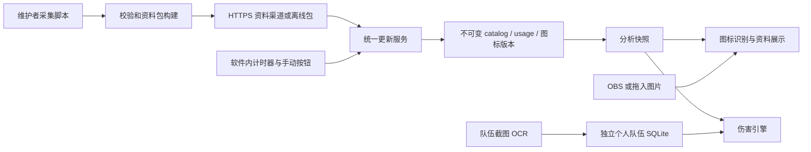
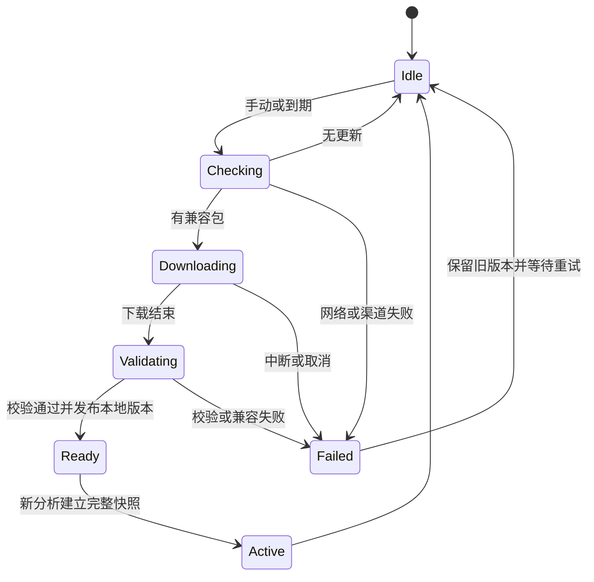
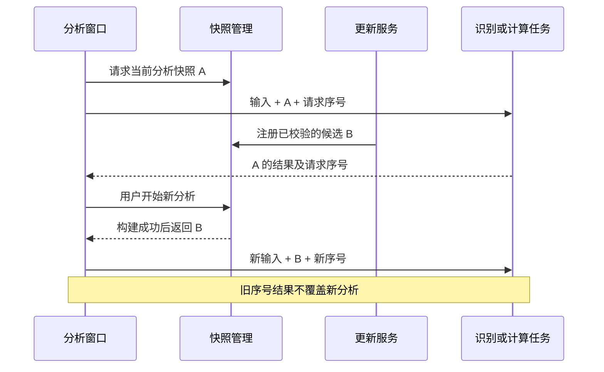

# Pokemon Champion Assistant v0.2 Productization - Plan

## Goal Capsule

**目标：** 将 v0.1.0 产品化为普通 Windows 玩家可以安装、更新并长期使用的桌面软件，同时提高识别准确率、响应速度与伤害场况设置的易用性。

**产品依据：** 用户认可上一轮提出的更新中心、数据整理、识别优化、视觉改版和安装发行路线，并补充辅助招式场况及 `例子2.png` 巨钳螳螂识别失败的要求。

**执行依据：** 用户最新指令优先，其次为本文件 Product Contract，再次为 Planning Contract。实施选择可以调整，产品范围和 R/F/AE 标识保持稳定。

**执行方式：** 优先完成 U1 识别修复、U2 场况完善；其余单元按依赖推进。先建立缺陷回归，打包使用真实运行验证；本次仅完成规划，不表示功能已实现或测试已执行。

**边界与交付：** 保留按队伍保存、己方按选中的预存配置计算、整队匹配规则及现有普通／Mega 选择。完成标准见 Verification Contract 和 Definition of Done；遇到必须改变这些规则的问题才重新讨论范围。实施阶段按单元提交，在 v0.2 分支整合、评审后发行；当前规划不推送、不创建发布任务。

---

## Product Contract

### Summary

软件提供统一更新入口、可独立安装的 Windows 发行包和一致的视觉体验。
识别优化同时关注准确率与耗时；辅助招式对本次伤害的影响通过明确的场况选项表达。

### Current Evidence

- 采用率已有启动检查、每小时复查及满 24 小时更新流程，见 `champion_assistant/ui/usage_updater.py`、`champion_assistant/data/usage.py`。
- 资料更新已有脚本、版本包、校验与回滚，见 `scripts/update_pokemon_data.py`、`champion_assistant/data/sync.py`。
- 己方队伍已经保存在 SQLite；公共图鉴、采用率和图标仍以资料包形式管理，见 `champion_assistant/teams.py`、`champion_assistant/data/references.py`。
- 当前匹配会遍历多尺度模板。一次本机样例测量为初始化约 0.8 秒、六只识别约 4.8 秒；单槽位调用模板匹配 4,620 次。这不是多样本性能基准，也不代表 OCR 耗时。
- “受到帮助”、反射壁、光墙、守住等已有 UI 选项及计算传递，见 `champion_assistant/ui/damage_dialog.py`、`champion_assistant/damage.py`；帮助有引擎数值回归，见 `tests/test_damage.py`。
- `例子2.png` 的识别失败与诊断实验见 `docs/research/2026-09-12-example2-recognition.md`。诊断尚未修改正式识别器。

### Key Decisions

**公共资料整理和识别提速分别验收。** 迁移数据库解决资料组织问题；识别速度需要减少图像匹配和重复处理，不能假定换数据库就能提速。

**发行以安装包为主要交付方式。** 用户不需要自行安装 Python、Node 或执行命令。单文件免安装 EXE 不是首要验收条件。

**更新数据与升级程序分开。** 公共资料更新不覆盖个人队伍；伤害规则与新资料必须保持兼容。源码继续私有时，安装包和更新包另设可访问渠道。

**先修正识别定位，再扩大优化范围。** `例子2.png` 的巨钳螳螂列为前置回归问题。不能以全局降低阈值、固定物种答案或破坏旧样例来通过验收。

**辅助效果按实际场况启用。** 已携带某个辅助招式不等于本次已受到该效果；显示作用对象，并记录在每格伤害详情中。

### Requirements

**更新与资料管理**

- R1. 软件内可以手动检查和运行资料更新，展示当前版本、更新时间、进度与结果。
- R2. 软件运行期间按设定间隔自动检查更新，默认采用率每天检查是否到期。
- R3. 更新失败或断网时继续使用有效的旧资料，并提供重试和恢复入口。
- R4. 一次对战分析固定使用兼容的资料与规则版本，后台更新在安全切换点生效。
- R5. 公共结构化资料统一整理，保持普通／Mega 等有对战差异的形态独立；图片可继续作为文件资源管理。
- R6. 预存队伍、截图导入来源和个人设置与公共资料升级隔离，迁移或升级后仍能读取。
- R7. 资料采集保留可独立运行的自动化入口，并逐步支持维护者采集校验后分发资料包。

**识别质量与响应**

- R8. `例子2.png` 中六个位置应正确输出暴飞龙、仙子伊布、风速狗（洗翠）、大狃拉、奇麒麟、巨钳螳螂。
- R9. 识别应容忍验收样本中的轻微画面偏移、缩放和边框差异，裁剪修正不得混入相邻槽位。
- R10. 对手图标识别与队伍截图 OCR 分别统计加载、处理和结果显示耗时；冷启动与连续识别分开衡量。
- R11. 图标识别预热后以六只约 2 秒内为优化目标，最终按约定硬件和多样本测试校准，同时记录误识别与待确认比例。
- R12. 不确定结果保留人工确认和诊断信息；提速不能以减少候选到真实身份不可达或增加误识别为代价。

**伤害场况与辅助效果**

- R13. 明确展示攻击方受到的支援、防守方受到的保护及全场环境，帮助、墙和守住等已有效果应容易找到。
- R14. 我方攻击时可启用我方受到帮助，对手攻击时可启用对手受到帮助；伤害方向变化后效果仍作用于正确的一方。
- R15. 选择效果后自动重算，并在结果详情列出已生效效果和适用条件，避免重复叠加。
- R16. 建立辅助招式／场况效果覆盖清单，区分直接影响本次伤害、影响速度或行动条件、以及暂不支持的效果。
- R17. 变化招式保持独立说明，不混入对手常用伤害招式列表；其造成的场况效果通过设置参与计算。

**界面与发行**

- R18. 先验证关键页面原型，再统一字体、间距、颜色、组件状态和软件图标，并检查缩放与小窗口可读性。
- R19. 新用户能从首次启动引导完成图片导入或 OBS 连接，再进入队伍配置与伤害分析。
- R20. 在没有开发环境的 Windows 机器上完成安装、启动、截图识别、队伍保存和双向伤害计算。
- R21. 程序升级保留个人队伍与设置，附版本说明、下载入口及失败恢复说明。

### Key Flows

- F1. 玩家打开更新中心，检查更新，下载并校验资料；失败继续用旧版，成功后在安全切换点使用新版本。覆盖 R1–R7。
- F2. 玩家拖入图片或从 OBS 采集，程序定位六个图标并识别；低置信度位置提供人工确认和诊断信息。覆盖 R8–R12。
- F3. 玩家选中双方与计算方向，设置受到帮助等实际效果；软件自动重算并展示独立随机范围与生效条件。覆盖 R13–R17。
- F4. 新用户下载安装包，从桌面入口启动，按引导完成首次分析；后续升级保留已有队伍。覆盖 R18–R21。

### Acceptance Examples

- AE1. 在原识别阈值保持有效的前提下，`例子2.png` 的第六槽位输出巨钳螳螂，同时 `例子.png` 的六个既有结果保持正确。覆盖 R8、R9、R12。
- AE2. 输入空白、严重遮挡或裁剪不完整的图标区域时，允许待确认，不强制给出物种。覆盖 R12。
- AE3. 对同一合法攻击情景启用攻击方受到帮助，结果与对应的独立机制用例一致；关闭后恢复基准范围。覆盖 R14、R15。
- AE4. 我方受到帮助时，不把该效果错误加到对手打我方的攻击上；对手受到帮助时按反方向验证。覆盖 R14。
- AE5. 队伍携带帮助但未启用场况效果时，程序不自动假定帮助已生效。覆盖 R15、R17。
- AE6. 资料下载中断或校验失败时，当前对战结果与个人队伍不被替换；恢复后可以重试。覆盖 R3、R4、R6。
- AE7. 从旧安装包升级后，预存队伍名称、培养点、性格、特性、道具与四招保持可用。覆盖 R6、R21。

### Milestones

| 顺序 | 阶段 | 主要产出 |
|---|---|---|
| 0 | 基线与打包验证 | 定位巨钳螳螂问题、建立样例回归、分段测速，验证独立打包可行性 |
| 1 | 数据与更新中心 | 公共资料整理、手动／自动更新、错误恢复与数据兼容 |
| 2 | 识别准确率与速度 | 修正裁剪边界、扩展多样本测试，再优化匹配和 OCR 响应 |
| 3 | 伤害场况完善 | 核对已有帮助等效果，补机制清单、方向验证和易用入口 |
| 4 | 视觉与交互改版 | 原型、组件和图标设计、首次使用引导 |
| 5 | 安装与发行 | 干净系统验证、升级保留数据、发行渠道和安装包 |

基础缺陷可在大阶段开始前修正，阶段顺序不要求等待数据库迁移完成才处理巨钳螳螂问题。

### Scope Boundaries

本轮不以重写全部界面技术、训练新识别模型或提供账号云同步作为前置条件。
伤害分析仍是给定场况下的单次计算，不扩展成自动推演整回合的对战引擎。
不改变预存队伍按队伍保存的原则；原整队匹配规则继续保留。

### Outstanding Questions

原先留给规划的技术问题在下文 KTD1–KTD8 中确定默认方案。剩余运行验证和视觉反馈见 Deferred Implementation Checks，不阻塞开始 U1。

---

## Planning Contract

### Problem Frame

v0.1 已具备核心对战辅助能力，但运行依赖开发环境，公共资料与采用率有独立版本生命周期，界面尚有分散的路径与样式设置。
识别的已知失败是槽位边界问题，耗时主要在多尺度模板遍历，二者都不应等待数据库迁移完成。
本计划属于分阶段的深度改造：用小范围修复尽快改善当前体验，再通过统一资源路径、资料读取接口和更新入口支撑桌面发行。

### Key Technical Decisions

- KTD1. **继续使用 Python、PySide6 Widgets 和现有 Node 伤害引擎。** 当前锁定 PySide6 6.11.2、RapidOCR 3.9.2、ONNX Runtime 1.30.0；沿用依赖快照，构建时锁定 Python 与 Node 版本。UI 使用统一主题和可复用组件改版，避免在已有功能稳定时引入 Web 前端重写。Node 作为随包资源，先查内置路径，开发环境才允许系统回退。
- KTD2. **PyInstaller onedir 加 Inno Setup 安装器。** 玩家下载一个 Setup.exe，安装后从快捷方式启动；完整包内包含 Python、Qt 插件、Node、规则快照、基础资料与 OCR 模型。先验证 onedir，之后生成安装器；不依赖每次启动的单文件解包。依据 [PyInstaller 运行方式](https://pyinstaller.org/en/stable/operating-mode.html) 和 [Inno Setup](https://jrsoftware.org/isinfo.php)。打包兼容性以 U3 的实机冒烟为准，不把工具选择视为打包已经成功。
- KTD3. **只读程序资源、可写公共资料、个人数据三处分离。** 用一个路径服务统一解析，开发模式保留现有目录参数；安装模式使用 Qt 的 AppLocalDataLocation 保存个人 SQLite、设置、下载及资料版本，CacheLocation 保存可丢弃缓存。程序目录只放发布资源，不依赖工作目录。首次迁移提供旧目录选择，备份后复制并校验，不删除旧文件；两端已有队伍时不覆盖目标库。参见 [Qt QStandardPaths](https://doc.qt.io/qtforpython-6/PySide6/QtCore/QStandardPaths.html)。
- KTD4. **公共资料使用分版本 SQLite，图标继续存文件。** 每个静态版本包含只读 catalog.sqlite 与校验后的图标；采用率单独使用不可变 usage.sqlite 快照，按物种／形态稳定 ID、赛季和单／双打建立索引。采集 JSON 保留为来源证据与构建输入，运行界面通过 ReferenceCatalog 适配器查库；不维护两套可写权威资料。个人 TeamStore 独立，普通、Mega、性别导致的战斗差异不合并；仅视觉差异沿用 recognition_identity_groups 规则。
- KTD5. **分析持有版本快照，更新在新分析开始时生效。** 一个快照包含静态版本、采用率版本、规则版本、布局与识别缓存版本。现有分析及其弹窗保持旧快照；新截图／重新分析才尝试构建新快照，成功后整体替换，失败保留原快照。采用率更新也不能原地修改当前 catalog。兼容性分两层处理：候选包的 schema、整体规则兼容标识、完整性或初始化不符合要求时，拒绝候选快照并保留旧分析；包级兼容但个别新形态缺少伤害映射时，允许新分析采用该快照并展示资料，仅将相关伤害标为不可计算及说明原因，不输出假数值。已打开的分析在这两种情况下都继续持有原快照。删除旧包前必须确认无读者，Windows 占用时延迟清理。
- KTD6. **所有入口调用同一个更新服务。** 维护者继续运行现有采集脚本；安装版默认下载维护者校验后的数据包，提供本地包导入作为离线途径。GUI 手动操作、软件内定时检查与 CLI 共享状态和校验逻辑；安装版通过专用后台任务入口运行，不再调用外部 Python。默认启动后检查，运行期间按小时判断距成功检查是否满 24 小时，可选 24 小时、72 小时、7 天或关闭；失败按 1 小时退避，不把失败记为成功，不补跑历史任务。手动检查绕过到期判断，但不绕过互斥锁。程序关闭后不执行任务，不创建 Codex 自动化。
- KTD7. **识别先修正定位，再做有基线的缓存优化。** U1 对每个槽位使用受相邻槽位中线及画面边界约束的小幅扩展，记录实际裁剪框和反向映射；首选由失败样例支持的参考尺寸上下各 4 像素作为起点，最终值按完整回归选择。模板 alpha、RGB 和重复数组转换预计算，复用已加载识别器；缓存键包含版本、模板哈希、尺寸及算法版本。粗筛仅在证明候选召回和误识别不退化后采用，并保留完整检索退路；本版不引入训练模型。
- KTD8. **辅助效果用显式、双方独立的场况描述。** 优先把帮助、墙、守住、友情防守和顺风分组并验证，首批新增极光幕的引擎映射与用例。UI 区分“已启用”“本招适用”“被忽略及原因”，不能把选中等同于生效；算法使用引擎的机制和取整，不在显示层自行乘倍率。已携带的辅助招式只提示可设置，不自动勾选。更广泛的招式依覆盖表逐项处理，不承诺完整回合模拟。

### Public Data Model

| 数据 | 关键字段与关系 | 校验／读取约束 |
|---|---|---|
| species / forms | 稳定来源 ID、简体名称、形态族、普通／Mega 关系、六项种族值 | 名称不是主键；有战斗差异的形态独立 |
| form_types / abilities / items | 属性顺序、特性／道具 ID、简体说明 | 外键完整；道具与个人选择分离 |
| moves / learnsets | 招式 ID、属性、类别、威力、命中、说明、形态 ID | 变威力／必中等保留原语义，不转成 0；单／双打来源明确 |
| assets / recognition_groups | 相对路径、哈希、普通／闪光、识别身份、就绪状态 | 缺图形态可查资料，但不进入识别模板 |
| usage_moves / usage_spreads | 版本、形态 ID、来源统计 ID、赛季、模式、采用率、六项培养点 | 无概率保持 NULL；保留性格是否为假设，不推断联合配置概率 |
| provenance / metadata | 来源、抓取时间、来源更新时间、schema、父版本、兼容规则 | 使用率快照绑定可兼容 catalog；陈旧或回退数据可见 |

catalog 与 usage 各自构建在临时目录，事务完成后执行完整性、外键、计数和领域校验，再进入版本包；个人队伍库不作为这些构建过程的输入。
在两个组件指针之上增加本地 release manifest，绑定 catalog_id、usage_id、schema 与规则兼容标识；组件全部落盘并校验后，一次原子替换活动 release 指针。采用率单独更新也创建新的组合描述，不让客户端独立读取两个 current.json 后自行拼接。组件指针用于旧入口兼容，安装版分析以 release manifest 为准；进程崩溃产生的孤立组件可稍后清理，不自动激活。
新格式先由构建器对旧 JSON 转换，再让适配器同时支持受控的旧包读取和新包读取，验证等价后将新包设为默认。旧资料回退仍可读取；不得在正常启动时重复迁移全库。

### Support Effect Coverage

| 效果 | 本轮交付 | 输入与边界 |
|---|---|---|
| 帮助 | 双方“本次受到帮助”，自动重算及详情 | 仅攻击方适用；反向计算不借用防守方帮助；固定伤害等由规则判断 |
| 反射壁／光墙 | 整理已有效果并补分类、要害与忽略条件测试 | 防守方场况；按物理／特殊及具体招式机制处理 |
| 极光幕 | 新增防守方选项、桥接和独立数值测试 | 不与两墙重复叠加；表示已存在的幕，不自动验证施放回合天气 |
| 守住 | 保留并明确保护对象、无效或穿透原因 | 对当前受支持招式按规则计算；不推演连续使用成功率 |
| 友情防守 | 保留为队友特性提供的保护效果 | 明确为队友效果，不根据本体拥有特性自动开关 |
| 顺风／天气／场地／能力等级 | 分组已有输入，显示用途 | 顺风属速度条件；对依赖速度的招式如有支持，仍按引擎处理，不概括为永不影响伤害 |
| 广域防守／快速防守／看我嘛／愤怒粉／戏法空间／再来一次等 | 覆盖说明表列出当前支持边界 | 未验证的保护、目标与行动顺序机制不作为伤害倍率选项；不能静默当已生效 |
| 电池／能量点／花之礼等队友效果 | 记录引擎能力与资料适用性，后续扩展 | 本版不因底层存在字段就直接开放未经验证的选项 |

覆盖表的“已支持”需要 UI → Python → Node 的整条路径证据；只有底层字段存在不算完成。
效应提示采用统一效果描述表，已有字段向后兼容；不让 UI 标签成为计算键。

### High-Level Technical Design

OCR 到队伍库之间仍经过现有预览、校正和保存步骤，不自动写入识别出的配置。

Ready 表示待下次分析采用；即使切换 current 指针，已打开的分析也继续持有自己的版本。启动失败可回退上个有效快照，恢复失败仍可从安装包附带的基线资料启动。

### Sequencing and Alternatives

实施顺序：U1 → U2 → U3 → U4 → U5 → U6 → U7 → U8 → U9 → U10。
U1、U2 不依赖资料迁移；U3 的运行时验证提前暴露打包风险。单元具体依赖见下表，不把产品 Milestones 的粗粒度顺序作为缺陷修复的阻碍。
优先发布小范围修复，再验证整合版本；v0.2 尚未全部完成时，不以单项完成宣称产品化已完成。

没有选择“所有东西塞进 SQLite”：图片文件更适合现有图标管线，模板匹配仍需内存数组。
没有选择 Electron/Tauri 重写：现有 Widgets 可先解决固定按钮、缩放、导航和样式；跨栈重写会扩大回归面。
没有选择客户端默认抓取全站：统一分发减少每台电脑面对网页结构变化的负担；维护者采集功能继续保留，来源故障时可使用最后有效包或随版本发行资料。

### Distribution and Recovery

首版提供可配置的固定 HTTPS 更新渠道和离线包导入。源码仓库保持当前权限；开发及私有试用可使用受控下载位置，不将 GitHub 私有仓库凭据写入客户端。面向公众发行时再选可公开下载的独立 release 仓库或静态托管，渠道地址不是开发的前置条件。
渠道清单包含包类型、版本、来源时间、schema、规则兼容范围、大小与 SHA-256；包内包含逐文件清单。客户端限制下载和解压总量、检查路径及扩展类型，资料包不能写到程序或个人目录，不能携带可执行更新脚本。哈希用于完整性，可信来源由配置的 HTTPS 渠道限定，不把同源哈希称为独立签名。
程序升级显示版本与发布说明、打开下载入口，由安装器执行升级；本版不实现运行中替换自身的程序热更新。静态资料与采用率可在软件内下载生效。
用户库迁移使用 SQLite 备份接口或关闭连接后的可靠副本，失败保留原库；参考 [SQLite Backup API](https://www.sqlite.org/backup.html)。回滚到不认识新 schema 的旧程序时提示恢复匹配备份，不强行写入新库。

### Deferred Implementation Checks

- U1 的最终裁剪边界与 U8 的线程／缓存规模需根据完整样例集选择，不能只凭单张图片确定。
- U3 验证现有 Python、Qt、OpenCV、ONNX 与打包工具组合；失败先定位缺失资源或钩子，再评估 Qt 官方部署工具，不默认更换业务栈。
- U9 在真正改主题前产出关键页面预览供用户反馈；默认方向为清楚、紧凑的对战工具，保留简体名与属性色，使用原创辅助工具图标。预览未收到反馈时可按已批准的可读性目标继续迭代，不阻塞 U1–U8。
- U10 在可用的干净 Windows 环境执行发布门禁；没有该环境则报告未验证，不能用开发机启动替代。Windows 11 x64 为首个验证目标；其他系统支持范围以实测列出。
- 公开下载地址、发行证书和公开渠道发布权限在发布阶段落实；本计划不新建付费服务。未配置在线渠道时，离线包与随版本资料仍可用，自动更新清楚提示渠道未配置。

---

## Implementation Units

以下“新增”路径为计划路径，其他路径为仓库已有文件；名称可在实施中微调并同时维护导入路径。

| 单元 | 目标 | 主要文件 | 依赖 |
|---|---|---|---|
| U1 | 修复槽位裁剪 | `champion_assistant/recognition.py`、`config/opponent_team_preview.json` | 无 |
| U2 | 完善辅助效果 | `champion_assistant/damage.py`、`champion_assistant/ui/damage_dialog.py`、`damage_engine/bridge.cjs` | 无 |
| U3 | 资源路径与打包冒烟 | `champion_assistant/paths.py`、`packaging/assistant.spec`、`scripts/build_windows.py` | 无 |
| U4 | 公共资料 SQLite | `champion_assistant/data/sqlite_catalog.py`、`champion_assistant/data/references.py`、`scripts/build_reference_database.py` | U3 |
| U5 | 固定分析版本 | `champion_assistant/data/snapshot.py`、`champion_assistant/ui/worker.py`、`champion_assistant/ui/main_window.py` | U4 |
| U6 | 软件更新中心 | `champion_assistant/data/update_service.py`、`champion_assistant/ui/update_dialog.py` | U3、U5 |
| U7 | 自动化数据包发行 | `scripts/build_data_bundle.py`、`.github/workflows/data-bundle.yml` | U4、U6 |
| U8 | 识别与 OCR 性能 | `champion_assistant/recognition.py`、`champion_assistant/team_import.py`、`champion_assistant/ui/worker.py` | U1、U5 |
| U9 | 统一视觉与引导 | `champion_assistant/ui/theme.py`、`champion_assistant/ui/onboarding.py`、`assets/branding/app.ico` | U2、U6、U8 |
| U10 | 安装升级和发行 | `packaging/installer.iss`、`.github/workflows/windows-release.yml`、`docs/release.md` | U3、U7、U9 |

### U1. Recognition Crop Regression

**Goal / Requirements：** 修复巨钳螳螂失败，保持可靠的待确认行为；R8、R9、R12，F2，AE1、AE2，KTD7。**Dependencies：** 无。

**Files：** `champion_assistant/recognition.py`、`config/opponent_team_preview.json`、`tests/test_recognition.py`；新增 `tests/fixtures/recognition/manifest.json`，引用既有 `例子.png`、`例子2.png` 和必要的脱敏裁剪样本。

**Approach / Patterns：** 沿用 prepare_image / match_slot 及现有 min_score、min_margin。引入可配置、有限的槽位外扩，对六槽统一处理并返回实际使用的裁剪坐标。先将例子2的预期六只及原样例写入回归清单，再修复，避免针对巨钳螳螂打补丁。布局文件老格式保留默认行为，非法扩展值拒绝。

**Test scenarios：**

1. Covers AE1：两张真实图均六只正确，例子2第六只为巨钳螳螂，不改全局阈值。
2. 参考尺寸轻微平移 ±2／±4 像素、720p／1080p 缩放、可容忍的小边框，定位与返回坐标一致；超出容忍范围提示重新裁剪。
3. Covers AE2：空白、严重遮挡、相邻槽干扰保持待确认；首末槽不得越画面边界。
4. 普通／闪光模板、Mega 和已有视觉合并形态的输出语义保持；不能将不同战斗形态强制归一。

**Verification：** 保存修复前后六槽结果与耗时，不引入真实样例的新误识别；诊断材料说明测试集规模，合成样本不冒充独立实战样本。

### U2. Explicit Support Effects

**Goal / Requirements：** 辅助效果易找到、方向正确、条件可解释；R13–R17，F3，AE3–AE5，KTD8。**Dependencies：** 无。

**Files：** `champion_assistant/damage.py`、`champion_assistant/ui/damage_dialog.py`、`damage_engine/bridge.cjs`、`tests/test_damage.py`、`tests/test_damage_ui.py`、`tests/test_damage_workflow.py`；新增 `champion_assistant/battle_effects.py`、`docs/validation/support-effects.md`；更新 `双向伤害计算使用指南.md`。

**Approach / Patterns：** 沿用 battle_defaults、BattleEditor、双方 battle 状态与现有延迟自动重算。用统一效果元数据驱动分组、字段兼容和说明；新增极光幕，明确其与墙的组合规则。结果区继续保留当前四招矩阵、双方攻击页、详情分隔条与缩放。对引擎已忽略的效果从 rawDesc／规则条件生成正确提示。

**Test scenarios：**

1. Covers AE3：复用现有帮助独立数值基准，开关恢复原值；不得以把当前结果简单乘 1.5 作为预期生成器。
2. Covers AE4：双方分别启用帮助后双向结果只在对应攻击方变化；切换普通／Mega、预存队伍、情景仍正确。
3. Covers AE5：只携带帮助不改变伤害。变化招式仍显示独立说明，不进入对手伤害招式列表。
4. 极光幕覆盖物理／特殊与双打；与对应墙同时启用不会重复减伤；要害、已支持的穿透／破墙招式和无效效果有正确输出。
5. 快速切换多个效果后仅最新计算刷新表格；详情区所示效果与该格输入一致，缺失旧字段读取为默认值。

**Verification：** UI、Python 和引擎集成用例通过；覆盖文档逐项标出已验证、仅说明、未支持及原因。

### U3. Runtime Paths and Packaging Probe

**Goal / Requirements：** 消除安装版对源码目录、系统 Python／Node 的依赖，保留用户数据；R6、R20、R21，F4，AE7，KTD1–KTD3。**Dependencies：** 无。

**Files：** 新增 `champion_assistant/paths.py`、`packaging/assistant.spec`、`scripts/build_windows.py`、`tests/test_runtime_paths.py`、`docs/validation/packaging.md`；修改 `launch_assistant.py`、`champion_assistant/ui/app.py`、`champion_assistant/ui/main_window.py`、`champion_assistant/ui/usage_updater.py`、`champion_assistant/damage.py`、`champion_assistant/team_import.py`、`champion_assistant/teams.py`、`champion_assistant/type_matchups.py`、`champion_assistant/data/sync.py`。

**Approach / Patterns：** 统一只读资源与可写目录解析，通过依赖注入继续允许测试临时目录。打包专用后台任务入口可处理更新请求；冻结程序不得使用现有 -c Python bootstrap。Node、Qt 平台插件、OCR 模型及规则目录显式纳入打包配置；默认离线 OCR。首次旧数据迁移可重复运行但不重复导入，失败回退原位置。

**Test scenarios：**

1. 从不同工作目录、中文及含空格路径启动，所有读写均落在正确位置；程序安装目录设为不可写仍正常。
2. Covers AE7：旧用户库复制后名称与完整六槽字段一致；中断、目标已有队伍、备份失败均不丢原库。
3. 打包目录中无系统 Python／Node 时可识别、启动后台任务、OCR 导入预览并算出已知伤害；缺失内置 Node／模型时明确指出缺少组件。
4. 关闭主窗口后后台任务退出；没有遗留进程和多余控制台窗口。

**Verification：** 单元测试验证路径和迁移；独立 onedir 冒烟记录运行时版本、资源列表与缺失项。此阶段不宣称最终安装验证完成。

### U4. Versioned Reference Database

**Goal / Requirements：** 公共资料统一查询，保持数据语义与个人配置；R5–R7，F1，KTD4。**Dependencies：** U3。

**Files：** 新增 `champion_assistant/data/sqlite_catalog.py`、`scripts/build_reference_database.py`、`tests/test_reference_database.py`；修改 `champion_assistant/data/references.py`、`champion_assistant/data/catalog.py`、`champion_assistant/data/usage.py`、`champion_assistant/data/storage.py`、`champion_assistant/data/sync.py`、`tests/test_data_updates.py`。

**Approach / Patterns：** 构建器读取已验证版本，按 Public Data Model 生成数据库与清单。ReferenceCatalog 保持现有调用接口和排序规则；各工作线程有自己的只读连接，不跨线程共享 SQLite connection。manifest 校验扩展到数据库文件；每次进程加载版本验证一次，查询不重复全文件哈希。原 JSON 兼容分支只用于旧版本，新增字段不回写旧包。

**Test scenarios：**

1. 对同一真实版本逐形态比较 JSON 与 SQLite：种族值、属性、Mega 家族、招式类别、说明、采用率及培养点一致。
2. NULL 采用率不变成 0%；属性／招式缺失、重复 ID、坏外键、损坏 SQLite、未知 schema 均拒绝发布。
3. 保留无图但有资料的形态、来源不同的同名项和视觉合并策略；不能误把普通与 Mega 合并。
4. 两个读者查询期间构建新库，旧库内容不变；旧格式版本回滚仍可查询。

**Verification：** 全量等价报告和领域校验通过，个人队伍库无公共迁移写入；数据库查询收益独立报告，不作为识别提速证明。

### U5. Analysis Snapshot Lifecycle

**Goal / Requirements：** 一次分析的所有页面使用一致版本；R3、R4、R6，F1、F2、F3，AE6，KTD5。**Dependencies：** U4。

**Files：** 新增 `champion_assistant/data/snapshot.py`、`tests/test_analysis_snapshot.py`；修改 `champion_assistant/data/references.py`、`champion_assistant/ui/worker.py`、`champion_assistant/ui/main_window.py`、`champion_assistant/ui/damage_dialog.py`、`champion_assistant/ui/usage_updater.py`、`champion_assistant/recognition.py`。

**Approach / Patterns：** 将现有 resolve_dataset 的一次解析扩展为静态、采用率、规则与模板缓存的一次性绑定，消除 reload_usage 对活动分析的原位更新。窗口与 worker 传递快照引用及请求序号；用户导入新图／重新分析才构建候选快照。更新成功显示“下次分析使用”，已有伤害详情继续可追溯。
补充组合 release manifest 及历史记录，启动时只读取一次组合指针，再打开相应组件；静态与采用率均能恢复上一有效组合。队伍编辑和截图导入中的资料视图也持有快照，避免只修主窗口而留下旁路。

**Test scenarios：**

1. Covers AE6：识别或伤害计算中发布新静态及采用率，旧结果仍引用原版本；下一次分析全部使用新版本。
2. 分别验证两层兼容性：候选包缺文件、schema 或整体规则兼容标识不匹配、初始化失败时拒绝新快照并保留旧分析；包级兼容但个别新形态缺少伤害映射时，新分析可展示该形态资料，仅对应伤害不可计算且说明原因，其他已支持形态仍可计算。
3. 多个弹窗、旧后台结果晚到、快速拖入第二张图片，不发生跨版本覆写；最后一个旧读者关闭后才可回收版本。
4. 回滚保留至少当前有效和上一有效版本，Windows 文件占用导致清理失败不影响使用。

**Verification：** 集成测试记录快照 ID 和结果来源；本轮所有更新入口都遵守生命周期，不只修复主窗口。

### U6. Unified Update Center

**Goal / Requirements：** 软件按钮、定时与 CLI 共享更新流程；R1–R4、R7，F1，AE6，KTD6。**Dependencies：** U3、U5。

**Files：** 新增 `champion_assistant/data/update_service.py`、`champion_assistant/ui/update_dialog.py`、`tests/test_update_service.py`、`tests/test_update_ui.py`；修改 `scripts/update_pokemon_data.py`、`scripts/update_usage_data.py`、`champion_assistant/ui/usage_updater.py`、`champion_assistant/ui/main_window.py`、`tests/test_usage_updater.py`、`docs/data-updates.md`。

**Approach / Patterns：** 保留现有 check/sync/validate/rollback 与采用率 if-due 兼容入口，新增结构化结果协议与进度事件。下载、验证、暂存、发布和回滚复用 storage 的 confined、atomic_bytes、update_lock；GUI 持续响应，可取消下载，发布指针的短事务不做中途取消。安装版模式不自动回退成全站抓取。窗口展示本地版本、来源更新时间、检查时间、待切换状态及“程序升级需安装新版”的区别。
锁归属统一到公共更新服务：当前静态更新由 CLI 外层持锁、采用率由 update_usage 内部持锁，重构后所有入口遵循同一锁层级，组件内部提供受控的已持锁调用路径，避免服务漏锁或重复获取非重入锁。跨进程最终发布使用组合 release 锁；若保留组件锁，固定获取顺序，绝不在持有组件锁时反向等待 release 锁。

**Test scenarios：**

1. 定时与手动同时触发只产生一项有效任务，跨进程锁也有效；无更新、更新成功、部分采用率回退均有明确状态。
2. 到期边界、时钟回拨、关闭再打开、休眠恢复、失败退避和手动强制检查符合 KTD6；关闭自动检查后手动仍可用。
3. Covers AE6：网络断开、取消、磁盘不足、摘要错误、路径穿越、过大解压包及未知 schema 均不替换旧版本和个人数据。
4. 软件冻结运行时可检查和导入离线包，进度与 CLI 结果一致；没有外部 Python 的错误提示。
5. 无在线渠道时说明原因并提供本地包导入；未知程序更新来源不自动执行文件。

**Verification：** 状态机各分支和真实 UI／后台任务集成通过，当前分析在更新期间不变，失败后能再次更新。

### U7. Reproducible Data Publication

**Goal / Requirements：** 维护者通过脚本或 CI 采集、校验和产出更新包；R7、R1–R3，F1，KTD4、KTD6。**Dependencies：** U4、U6。

**Files：** 新增 `scripts/build_data_bundle.py`、`.github/workflows/data-bundle.yml`、`tests/test_data_bundle.py`；修改 `scripts/update_pokemon_data.py`、`scripts/update_usage_data.py`、`docs/data-updates.md`；新增 `docs/release.md`。

**Approach / Patterns：** 现有来源适配器作为采集入口，输出版本化的静态包／采用率包和渠道清单。可手动启动 CI，也可启用每天一次的维护者任务；仅在有效内容变化时产出新包。顺序为采集→领域校验→构建→客户端导入验证→上传包→最后发布渠道清单；中途失败不移动稳定清单。新包无代码，仅包含准入资源，发布不包含本地队伍、OBS 密码或用户截图。

**Test scenarios：**

1. 无内容变化不产生新版本，采集时间与版本身份分开；赛季变化不会把旧赛季标成新数据。
2. 来源结构变化、少量采用率失败、批量物种消失分别按已有回退与保护规则处理，报告陈旧项。
3. 生成包经 U6 导入后与构建源一致；上传中断、客户端读到旧清单或缓存清单都不产生半更新。
4. 同批失败后重试幂等；构建输出不含个人目录和密钥。静态与采用率版本关系不兼容时拒绝发布组合。

**Verification：** 本地脚本与 CI 生成格式一致，离线端到端演练通过；实际公开发布按最终渠道执行，未配置前产物留在构建产物区。

### U8. Measured Recognition Performance

**Goal / Requirements：** 保持准确率的前提下缩短等待，分开报告图标和 OCR；R9–R12，F2，KTD7。**Dependencies：** U1、U5。

**Files：** `champion_assistant/recognition.py`、`champion_assistant/team_import.py`、`champion_assistant/ui/worker.py`、`champion_assistant/ui/team_import_dialog.py`、`tests/test_recognition.py`、`tests/test_team_import.py`；新增 `scripts/benchmark_recognition.py`、`tests/test_recognition_cache.py`、`docs/validation/recognition-performance.md`。

**Approach / Patterns：** 基于上一轮已记录的 matchTemplate／模板合成热点，先预计算模板通道和 alpha、复用图像预处理与已加载引擎，限制 OpenCV 与 Python 嵌套并发。OCR 实例按进程／工作线程安全边界复用，避免每次导入重复初始化；图片任务均保留取消和旧结果抛弃。持久化缓存使用不执行代码的数据格式，损坏时重建，不使用不可信 pickle。

**Test scenarios：**

1. 同一固定样例集对比优化前后六槽输出、误识别及待确认数；未命中缓存、命中缓存输出一致。
2. 模板／布局／合并规则／算法版本变化使缓存失效；坏缓存、磁盘满仍可走原始加载。
3. 连续识别与取消期间 UI 可操作，线程不累积；新快照不会复用旧模板。
4. 能力／状态截图配对导入结果不退化，OCR 冷启动与复用耗时单独报告，不把 OCR 初始化排除后称为首次导入时间。

**Verification：** 按下文性能门禁报告各阶段耗时、硬件、内存、样本数量；未达到阈值不得仅以“界面不卡”宣称提速完成。

### U9. Desktop Visual System and Onboarding

**Goal / Requirements：** 提升信息可读性和初次使用体验；R13、R18、R19，F2–F4，KTD1。**Dependencies：** U2、U6、U8。

**Files：** 新增 `champion_assistant/ui/theme.py`、`champion_assistant/ui/onboarding.py`、`assets/branding/app.svg`、`assets/branding/app.ico`、`docs/design/v02-desktop.md`、`tests/test_onboarding.py`；修改 `champion_assistant/ui/main_window.py`、`champion_assistant/ui/widgets.py`、`champion_assistant/ui/dialog_layout.py`、`champion_assistant/ui/team_dialog.py`、`champion_assistant/ui/damage_dialog.py`、`champion_assistant/ui/obs_dialog.py`、`tests/test_desktop.py`、`tests/test_damage_ui.py`。

**Approach / Patterns：** 先提供主页、队伍、伤害和更新中心原型，再抽取统一主题与状态样式。主界面保留清楚的对手六槽、资料／速度／伤害入口；队伍、更新、设置使用稳定导航。复杂对话框保留最大化与详情分隔条，保存按钮固定可见；原先全文缩放与分配详情提示不回退。引导允许跳过，图片路线无需 OBS；OBS 路线检查服务启用、连接参数与来源，密码留在本机输入，不进入日志。

**Test scenarios：**

1. 1366×768、1920×1080 和系统 100%／150%／200% 缩放，主要按钮可达、内容可滚动、详情可调整；不以缩小字体掩盖溢出。
2. 键盘导航、焦点、悬浮／点击招式说明、常用分配详情、全屏退出和手动调整窗口正常。
3. 首次图片路线、OBS 服务未启用／认证失败／无来源／连接成功路径都有明确下一步；跳过引导后可重新打开。
4. 保存／重命名队伍、普通与 Mega 切换、自动双向伤害与辅助效果显示均保留。

**Verification：** 交互测试与实际截图审查结合；纯颜色／图标不添加镜像式单元测试。记录选定视觉方案和小屏问题关闭情况。

### U10. Windows Installer and Release Gates

**Goal / Requirements：** 普通用户安装、升级与离线使用可行；R18–R21、R6，F4，AE7，KTD2、KTD3。**Dependencies：** U3、U7、U9。

**Files：** 新增 `packaging/installer.iss`、`.github/workflows/windows-release.yml`、`tests/test_release_manifest.py`；修改 `packaging/assistant.spec`、`scripts/build_windows.py`、`docs/validation/packaging.md`、`docs/release.md`、`README.md`、`OBS使用指南.md`、`队伍配置使用指南.md`、`截图导入队伍指南.md`、`双向伤害计算使用指南.md`。

**Approach / Patterns：** 按用户安装、桌面／开始菜单入口、卸载默认保留个人资料。构建版本化 Setup.exe、校验清单、第三方许可证与说明，安装包默认含有效离线数据。版本号、图标和程序更新入口一致；生成升级演练用的旧版本安装包，不能把 v0.1 源码目录当成已存在的旧安装包。公开发布与私有源码权限分离。

**Test scenarios：**

1. 干净 Windows 11 x64 标准用户，无 Python／Node，断网安装启动、图片识别、OCR 预览、队伍保存、普通／Mega 双向伤害均可用。
2. Covers AE7：开发目录迁移及旧安装版升级分别验证；相同用户库指纹、队伍名称、培养点、性格、特性、道具、四招保留。
3. 升级中断、安装取消、重新安装、卸载后再装、旧程序遇到新 schema 均不静默清空数据。
4. 有 OBS 的实机验证来源采集；没有 OBS 时图片路线正常且引导清楚。自动更新正常、断网、坏包、恢复有效旧版本均在安装版演练。
5. 发布目录资源齐全、不包含私有配置，诊断信息能定位运行时问题且不含密码。

**Verification：** 安装器与实际发布产物一致，干净环境演练留存；测试机或在线渠道缺失必须标为未完成，不将可本地运行等同于可发行。

---

## Verification Contract

下列命令是现有仓库的验证入口，仅供实施阶段使用；本次规划未运行测试。新增测试也由相同 pytest 入口发现。

| 门禁 | 入口／证据 | 通过标准 |
|---|---|---|
| 缺陷与效果 | `.venv-ui/Scripts/python.exe -m pytest tests/test_recognition.py tests/test_damage.py tests/test_damage_ui.py tests/test_damage_workflow.py -q` | AE1–AE5 与本轮效果用例通过，无新误识别或方向错误 |
| 全部自动测试 | `.venv-ui/Scripts/python.exe -m pytest tests -q`；无显示环境设置 QT_QPA_PLATFORM=offscreen | 既有与新增用例全部通过，不以忽略失败完成迁移 |
| 公共资料 | `.venv-ui/Scripts/python.exe scripts/update_pokemon_data.py validate`；SQLite 等价与包导入报告 | 图标哈希、领域完整性、静态与统计来源、形态数量可追溯 |
| 真实识别 | 原始两张截图、增补独立实战样本与明确标记的合成扰动集 | 原图全对，困难样本允许待确认；无错报增加，阈值策略有依据 |
| 性能 | U8 基准脚本输出基线／优化后报告 | 同一硬件、资料、布局、图片，每图至少 20 次；冷启动另报，预热六槽端到端中位数 ≤2 秒，p95 ≤3 秒；不达标标为未完成，调整目标需说明证据 |
| 更新一致性 | U5/U6 集成用例和安装版更新演练 | 新旧分析隔离、坏包不生效、失败可恢复、个人数据不变 |
| 桌面发行 | U10 干净系统验证记录 | 无开发依赖仍通过完整用户流程，升级与卸载保留数据 |

端到端图标计时从已获得图片输入开始，到六槽结果可显示结束；OBS 网络取图另列，模板加载计入冷启动，不能从热测试中混入初始化后再选取最好结果。
性能报告固定硬件与电源模式，先保存现状再优化；独立实战样本不足时明确准确率外推限制。OCR 暂不承诺绝对时限，至少不退化并报告首次／重复导入耗时及结果准确性。
全量测试仅在相关阶段整合或新风险出现后运行，不在每个文档／样式小调整后重复。

---

## Definition of Done

- R1–R21 均有对应单元和验收证据；U1–U10 的 Verification 与 Test scenarios 达成，未完成项明确列出，不以计划就绪冒充功能完成。
- 巨钳螳螂及既有真实截图回归通过；性能满足已定义门禁且没有已知样本误识别退化，OCR 结果保留可校正流程。
- 辅助效果支持表、UI 分组、双方计算和每格详情一致；普通／Mega、固定伤害、变化招式及不支持机制都保持诚实输出。
- 公共 SQLite、版本快照、手动／软件内定时更新与维护者脚本集成完成；离线、坏包、并发及回滚路径经过验证。
- 用户队伍与设置迁移和升级可恢复，原整队匹配规则及按预存队伍计算不改变。
- 最终界面在规定窗口／DPI 可用，安装包在干净目标系统通过验证，说明、图标、版本、依赖资源和下载方式齐全；尚未实际完成公开发布时明确为候选发行包。
- 最终变更清理废弃实验代码、重复入口和无效缓存策略；实验产物留在忽略目录，正式证据在 docs/validation，提交不带个人数据库、OBS 密码或用户原始截图中的敏感信息。
