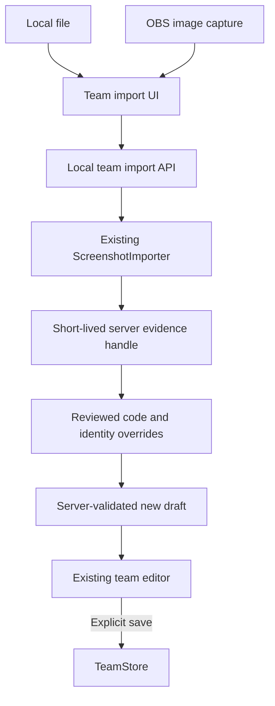
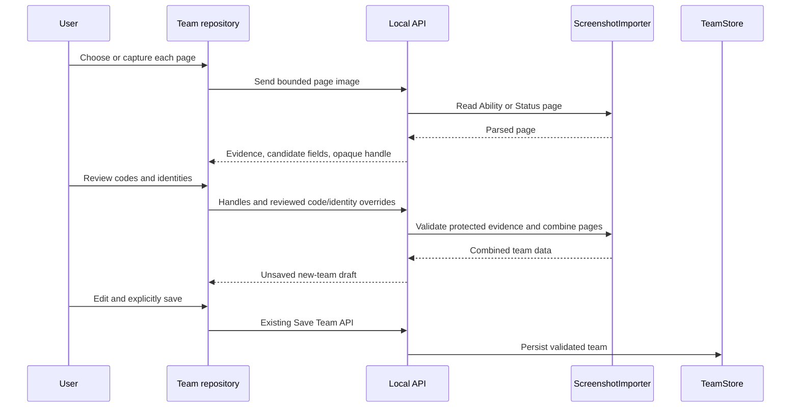
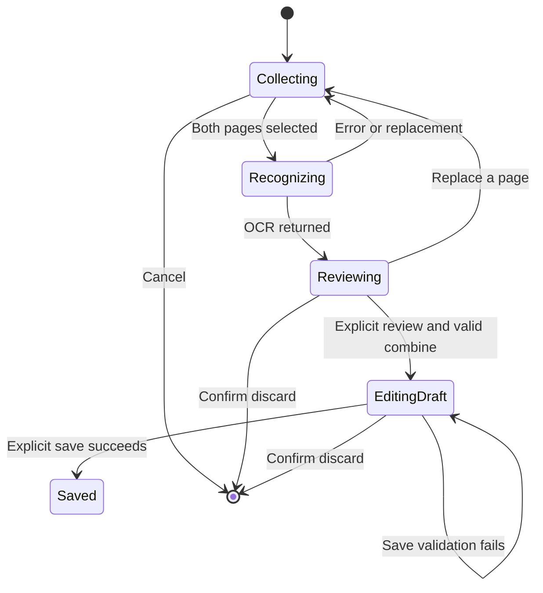

# v0.4.0 Team Screenshot Import - Plan

## Goal Capsule

Restore own-team screenshot import inside the current single-window Champion Lab interface and ship it as a v0.4.0 Windows candidate. The user's confirmed scope controls behavior; existing local OCR, OBS, team validation, and release gates control implementation. Never persist a team before explicit save, overwrite an existing team through import, expose OBS credentials, or treat a development-machine install as clean-VM validation. Implementation owns code, tests, candidate packaging, and an evidence-backed release decision; stable release remains gated by independent Windows acceptance and signing status.

---

## Product Contract

### Summary

The team repository will accept an Ability screenshot and a Status screenshot, each from a local image or OBS. The user previews both, reviews OCR evidence and corrections, then loads a new unsaved team draft into the existing editor before explicitly saving it. v0.4.0 also updates the Windows candidate installer and validates that existing desktop functions and personal teams still work.

### Problem Frame

The older Qt team editor offers screenshot import, but the current React/WebView team repository has only manual editing. The Battle screen's upload and OBS actions recognize the opponent lineup, not the user's saved team. This leaves users unable to restore their own team from the game's two detail pages in the default desktop interface.

### Requirements

**Capture and recognition**

- R1. Show a screenshot-import entry in the team repository, including when no team has been saved yet.
- R2. Accept separate Ability and Status pages in either order, with local-file or OBS capture independently selectable for each page and an original-image preview.
- R3. Use the existing offline `ScreenshotImporter` to identify six cards, reject the wrong page type or invalid image, and return OCR evidence without saving source images or teams.

**Review and persistence**

- R4. Let the user inspect and correct each page's ten-character team code and six slot identities; make uncertain fields visible rather than silently guessing them.
- R5. Require explicit review before combining pages; reject missing or mismatched team codes, mismatched slot identities, and invalid or duplicate identities.
- R6. When an identity is corrected, invalidate ability and moves inferred for the previous identity; load the combined result as a new unsaved draft for further editing.
- R7. Save only after the user chooses the existing Save Team action; importing must never inherit an existing team's ID or revision or overwrite it.

**Lifecycle and release**

- R8. Replacing either image, retrying, or leaving the flow must not mix old OCR responses with new inputs or silently discard an unsaved draft.
- R9. Keep image-size limits, loopback-only API behavior, OBS password handling, and the existing opponent-recognition and damage flows intact.
- R10. Mark the application and installer v0.4.0, run regression and installed-package checks, and publish only as a candidate while clean Windows 11 and signing gates remain unmet.

### Key Flows

- F1. Local import: enter Team Repository → choose both page images → preview and recognize → review codes and identities → load new draft → edit unknown fields → save explicitly.
- F2. OBS import: select or reuse the configured OBS source → capture either page → preview → follow the same recognition and review path as F1; file and OBS sources may be mixed.
- F3. Recovery: a bad page, OBS failure, unresolved mismatch, cancellation, or replacement leaves saved teams unchanged and offers a clear retry path.

### Acceptance Examples

- AE1. With an empty repository and two valid screenshots, the import entry remains visible; after review the six-member draft appears, but the repository stays empty until Save Team succeeds.
- AE2. If Ability and Status codes differ, or slot three identifies different Pokémon, combining is refused and no team is written.
- AE3. If the user corrects slot one from one form to another, that slot's old ability and four moves become unknown and must be reviewed again.
- AE4. If the user replaces the Ability page while its earlier OCR request is still running, the earlier response cannot replace the newer page or re-enable the old review confirmation.
- AE5. An OBS password saved for the current Windows user can be reused for capture but never appears in an API response, import metadata, or visible error.
- AE6. Installing v0.4.0 over v0.3.0 preserves existing personal teams and settings; the new screenshot import works in the packaged single-window app without a separate command window.

### Scope Boundaries

This is an own-team detail-page import, not opponent six-slot recognition. It supports the two known purple-card Ability/Status layouts already covered by `ScreenshotImporter`; adding a new game layout or an online team-code lookup is outside v0.4.0. The existing legacy Qt import remains available as a fallback. No change to damage rules, public data bundles, or automatic stable update channels is planned.

#### Deferred to Follow-Up Work

- Additional screenshot layouts and automatic detection of arbitrary team pages.
- A clean Windows 11 acceptance run and code-signing setup if the necessary environment or certificate is unavailable during candidate packaging.

---

## Planning Contract

### Key Technical Decisions

- KTD1. Reuse `ScreenshotImporter.read_page()` and `combine()` rather than building a second OCR parser. The legacy flow already encodes layout, confidence, same-team, and form-safety rules, with real-image regression fixtures in `tests/test_team_import.py`.
- KTD2. Add own-team import endpoints beside, not inside, the opponent `/api/recognize` and `/api/obs/capture` routes. A bounded image request produces one page of review evidence and an opaque handle to its short-lived server-held OCR result. A separate combine request accepts two handles plus only reviewed codes and six slot identities per page; it never trusts client-supplied OCR fields. Existing `/api/teams` remains the sole persistence step.
- KTD3. Keep original screenshots in browser memory for preview and use random-named, request-scoped temporary storage only where the path-based importer requires it. File and raw OBS image inputs converge on one adapter with a 25 MB encoded-image limit and 30-million-pixel decoded-image limit before OCR or preview response. OBS capture reuses saved connection settings and DPAPI-held password without echoing credentials; image responses use `Cache-Control: no-store`.
- KTD4. Keep only bounded, expiring OCR evidence handles in server memory, with no image bytes (30-minute TTL, maximum 64 live handles, oldest-first eviction). Bind evidence to the current catalog snapshot; reject expired, missing, or stale-catalog handles. If a handle expires during human review, retain both original image blobs and unsubmitted corrections in browser memory, re-recognize the affected page from that exact blob (never re-capture a changed OBS scene), revoke prior confirmation, and require a fresh review before combine; catalog refresh also requires re-recognition. Before combine, enforce exact ordered slots 1–6, page modes, ten-character codes, six valid distinct catalog identities, and cross-page agreement. Apply only whitelisted corrections to protected OCR evidence; identity changes clear dependent ability/moves. Return an editor-ready draft with empty ID and zero revision. At the `/api/teams` save boundary, whitelist and size-bound `import_source` provenance (OCR text/confidence, hashes, dimensions, correction markers), excluding original filename/path, image or data URL, arbitrary metadata, and OBS secrets even from a crafted client.
- KTD5. Treat import as an explicit draft lifecycle in the team repository. Replacing an input revokes review, request generations ignore stale responses, and navigation or team switching asks before discarding unsaved work. Implement the leave-page guard at `App.tsx` navigation and the team/new/duplicate guard in `TeamPage`, including its empty-repository branch. Do not let the current selected-team refresh effect reset an active imported draft.
- KTD6. Add focused React interaction tests because the current frontend has lint/build checks but no behavioral test harness; retain Python API/domain regressions and installed WebView smoke coverage. New test-only dependencies must not enter the frozen runtime.

### High-Level Technical Design

The following diagrams describe the intended boundaries and lifecycle; implementation details remain governed by the decisions and acceptance examples above.

### Sequencing and System-Wide Impact

The existing own-team SQLite schema need not migrate: `TeamStore` already saves imported drafts and metadata. Backend image/OBS handling precedes the review UI, and both precede packaging. Only the Team Repository uses the new import state; opponent recognition and damage continue to consume saved teams through current APIs. A long local OCR call may occupy a request thread, so the UI must remain responsive, show progress/busy state, and permit safe retry without assuming a network service.

### Risks and Dependencies

- OCR may be uncertain or slow on real capture resolutions. Keep the known 25 MB request bound and importer 30-million-pixel bound, show actionable errors, and use both existing large and smaller fixture pairs for regression; do not claim arbitrary screenshot accuracy.
- A stale page response or current-team refresh could replace a newer draft. Isolate import state from selected persisted-team state and cover replacement, navigation, and late-response behavior with interaction tests.
- A client-provided page object is not authoritative simply because it came from the UI. The combine route must resolve bounded server-held evidence handles, apply only code/identity overrides, validate exact slot order, catalog snapshot, cross-page agreement, and team rules; never call `TeamStore.save` during recognition or combine.
- OCR provenance may contain a user-controlled source filename or request path. Strip these before returning or persisting metadata; use random temporary names, finally-cleanup, a save-boundary allowlist, and tests that scan responses, saved payloads, and error/log text for test filenames, image bytes/data URLs, and passwords.
- The release pipeline and installed package must include the new frontend and OCR model. Local validation proves a candidate only; record missing clean-VM and signing gates honestly.

---

## Implementation Units

### U1. Add bounded own-team page and OBS image adapters

- **Goal:** Expose local screenshot inputs to the existing OCR without coupling to opponent recognition.
- **Requirements:** R2, R3, R9; F1, F2, F3.
- **Dependencies:** None.
- **Files:** `champion_assistant/webapp.py`, `champion_assistant/capture/obs.py`, `champion_assistant/team_import.py` if a narrow input adapter is necessary, `tests/test_webapp.py`, `tests/test_team_import.py`, new focused OBS capture tests.
- **Approach:** Add dedicated Ability/Status image recognition and raw OBS capture routes. Reuse request-origin checks, saved OBS settings, and path-based OCR through random-named request-scoped temporary images. Extend the OBS capture adapter to expose raw encoded PNG (or a team-import-specific bounded decode path), since existing `ObsCapture.screenshot()` already returns a decoded PIL image and its decoder permits 40 million pixels. Enforce 25 MB encoded and 30-million-pixel image limits for team import before returning preview bytes or running OCR, without changing existing opponent-capture behavior. Return visible page evidence and a short-lived opaque evidence handle, never credentials, original paths, or persisted originals; bound handle count and expiry.
- **Patterns to follow:** `/api/recognize` bounds and origin check in `champion_assistant/webapp.py`; `ScreenshotImporter.read_page()`; `ObsCapture.screenshot()`.
- **Test scenarios:** (1) A valid Ability and Status fixture sent as separate image requests returns the expected modes, six members, and source hashes. (2) An OBS mock returns a previewable image and uses the stored password without including it in responses or errors. (3) Oversized encoded or decoded images, non-images, cropped, and wrong-page inputs fail with client-facing errors and leave no temporary image behind. (4) A foreign Origin remains rejected. (5) Raw OBS responses are non-cacheable; test filename/password markers do not appear in JSON, persisted data, or error/log text.
- **Verification:** Local API accepts each valid source and does not write a team or retain an original image.

### U2. Validate reviewed pages and produce an editor-ready new draft

- **Goal:** Preserve the legacy review gate and prevent mismatched pages or overwrites.
- **Requirements:** R4–R7, R9; F1–F3; AE2, AE3, AE5.
- **Dependencies:** U1.
- **Files:** `champion_assistant/webapp.py`, `champion_assistant/team_import.py`, `tests/test_webapp.py`, `tests/test_team_import.py`, `tests/test_teams.py`.
- **Approach:** Resolve two unexpired evidence handles from the same catalog snapshot, accept only reviewed codes and six identities for each, then validate page modes, exact ordered slots, identities, code format, and cross-page agreement before calling existing combine and team-rule validation. Reject client-supplied changes to OCR ability/item/moves/points/source fields; clear ability/moves tied to corrected identities. Hydrate member display data while forcing new-team ID/revision semantics. Sanitize and size-bound provenance again at the save API, since its current storage path otherwise preserves extra top-level team metadata.
- **Execution note:** Add characterization tests for the legacy review rules before changing their shared path.
- **Patterns to follow:** `TeamImportDialog.use_draft()` and `ScreenshotImporter.combine()`; `WebServices.team_view()` and `TeamStore.save()`.
- **Test scenarios:** (1) Covers AE2: different or missing codes and divergent slot identities reject combine and leave the isolated store empty. (2) Covers AE3: correcting an identity clears only that slot's old ability and four moves. (3) Malformed mode, missing/extra/reordered/duplicate slots, unknown or duplicate identities, expired/missing/stale-catalog handles, and oversized JSON reject before a draft is returned. (4) Tampered OCR fields or source hashes sent by a client cannot alter server-held evidence; crafted save requests containing image data URLs, original paths, passwords, or oversized `import_source` cannot persist those fields. (5) Valid reviewed pages return six hydrated members, `id=''`, `revision=0`, and sanitized source evidence; only a later explicit save adds a team. (6) With an existing team in the isolated store, recognition, failed combine, and new draft leave its payload/revision fingerprint unchanged; explicit save adds a separate record.
- **Verification:** A draft can enter the current editor and save once without modifying a pre-existing team; failed or unreviewed combinations never persist.

### U3. Add the review-and-import journey to the single-window team repository

- **Goal:** Make local and OBS import discoverable, reviewable, and safe alongside manual editing.
- **Requirements:** R1–R8; F1–F3; AE1, AE4, AE5.
- **Dependencies:** U1, U2.
- **Files:** `web/src/pages/TeamPage.tsx`, `web/src/pages/TeamImportPanel.tsx`, `web/src/api.ts`, `web/src/model.ts`, `web/src/App.tsx`, `web/src/index.css`, `web/package.json`, `web/pnpm-lock.yaml`, `web/src/pages/TeamImportPanel.test.tsx`, `web/src/pages/TeamPage.test.tsx`, `tests/test_embedded_web.py`.
- **Approach:** Add an import action in both normal and empty repository states. Let each page use file or OBS, show original previews with a keyboard-accessible enlarge view and OCR candidate/evidence, and require code/identity review before loading an isolated unsaved draft. Keep both original image blobs and unsent corrections in browser memory for retry; an expired evidence handle triggers re-recognition of the same image, retains corrections for comparison, revokes old confirmation, and requires fresh review. Reuse TeamPage member controls for unknown fields and its Save Team action. While that draft is active, show an explicit "unsaved imported team" label, remove the old saved-team sidebar highlight, and hide saved-team-only delete actions; select the newly saved team only after save succeeds. Guard App-level navigation plus team/new/duplicate transitions, ignore stale async results after replacement/cancellation, and keep image object URLs temporary. Add the new component to the currently explicit frontend lint file list and provide a runnable behavioral-test script.
- **Patterns to follow:** Existing TeamPage manual editor and `api.ts` request/error conventions; BattlePage's image/OBS controls; shared AppShell visual and keyboard conventions.
- **Test scenarios:** (1) Covers AE1: empty repository still offers import and a reviewed valid pair creates a six-member editor draft without calling save. (2) Ability from file plus Status from mocked OBS produces the same review flow; OBS failure can be retried without losing the other page. (3) Covers AE4: replacing a page revokes prior confirmation and a late response cannot overwrite the new source. (4) An expired handle re-recognizes the original image without a new OBS capture, preserves visible corrections, revokes confirmation, and requires a new review before combine. (5) Switching a team, creating a new team, or leaving the page with an unsaved import prompts before discard; cancelling preserves the draft. (6) A failed combine stays in review with the error visible; unknown fields remain editable; explicit Save Team persists and refreshes selection. (7) The imported draft is visibly unsaved, old team selection/delete is not active, and successful save selects the new record. (8) Both previews can be enlarged by keyboard for code/identity checks; dark theme and 1366×768/150% scaling keep review and save reachable.
- **Verification:** A user can complete the entire flow in the embedded desktop window without legacy dialogs, browser pop-ups, or unintended persistence.

### U4. Version, package, and verify the v0.4.0 candidate

- **Goal:** Produce a reproducible Windows candidate while protecting v0.3.0 personal data and established behavior.
- **Requirements:** R9, R10; AE6.
- **Dependencies:** U1–U3.
- **Files:** `champion_assistant/version.py`, `web/package.json`, `packaging/installer.iss`, `docs/release.md`, `docs/releases/v0.4.0.md`, `docs/validation/packaging.md`, `tests/test_release_manifest.py`, `tests/test_embedded_web.py`.
- **Approach:** Bump one coherent app/frontend/installer version, update release and validation documentation, then build and validate the frozen app and Setup through existing scripts. Under the same Windows user and one isolated `CHAMPION_USER_DIR`, establish v0.3.0 team/settings/DPAPI credential baselines, upgrade, compare database integrity and content fingerprints, exercise OBS capture plus two-image OCR and explicit save, and record manifest and installer hashes. Publish only a prerelease candidate if all locally available gates pass.
- **Execution note:** This unit is packaging-heavy; installed-runtime and upgrade smoke proof matter as much as unit coverage.
- **Patterns to follow:** `scripts/build_windows.py`, `.github/workflows/windows-release.yml`, `packaging/installer.iss`, `docs/validation/packaging.md`.
- **Test scenarios:** (1) Built manifest and installed `/api/bootstrap` report 0.4.0 with the React assets and OCR models present. (2) Covers AE6: v0.3.0 isolated user data passes `PRAGMA integrity_check`; team payload/revision, settings, and DPAPI file hash survive upgrade, and stored credentials still authorize capture. (3) The v0.4.0 single-window app completes a file-pair import; no command window or secondary dialog is required, and old opponent capture and damage smoke pass. (4) Uninstalling the isolated test copy removes only that copy while leaving the isolated personal directory and the user's actual data untouched; a failed clean-VM/signing gate leaves the release labeled candidate.
- **Verification:** Candidate Setup, SHA-256, test reports, and unmet release gates are recorded; no stable-release claim is made without its required evidence.

---

## Verification Contract

| Gate | Evidence expected | Covers |
|---|---|---|
| `python -m pytest tests/test_team_import.py tests/test_webapp.py tests/test_teams.py -q` | Real-image OCR and new import API/review regressions pass. | U1, U2 |
| Frontend test script, `pnpm --dir web lint`, `pnpm --dir web build` | Review state, async replacement, empty repository, type checks, and production bundle pass. | U3 |
| `python -m pytest tests -q` | Existing opponent recognition, damage, Qt, storage, and release tests retain their results. | U1–U4 |
| Frozen worker self-check with isolated `CHAMPION_USER_DIR` and the two existing screenshot fixtures | Packaged offline OCR, built-in Node, catalog, and team store work without developer services. | U4 |
| Isolated Setup install, WebView import/save, upgrade, and uninstall smoke | Single-window v0.4.0 operation, unchanged personal team fingerprint, and clean removal of the test installation. | U3, U4 |

Use `pytest.ini`'s `tests` collection scope so historical copies under `artifacts/` cannot affect regression counts. Compare both result status and count to the pre-change baseline, and investigate any difference before packaging. Capture user-interface evidence for local file, OBS, review error, and successful save; test using mock OBS for deterministic automation and a real source when available. Clean Windows 11 acceptance and signing remain separately reported release gates.

---

## Definition of Done

- All R1–R10 and AE1–AE6 behaviors are demonstrated; import never saves or overwrites without an explicit Save Team action.
- U1–U4 have passing targeted tests, full Python regression, frontend behavioral/lint/build checks, and an installed candidate smoke report.
- The version and packaged assets consistently identify v0.4.0; personal teams and OBS credentials survive an isolated v0.3.0 upgrade.
- Candidate artifacts have recorded SHA-256 and clearly state unverified clean-VM/signing gates; public stable release is not implied.
- Any abandoned implementation attempt or temporary test installation is removed without touching user-owned files, existing installations, or unrelated worktree changes.
